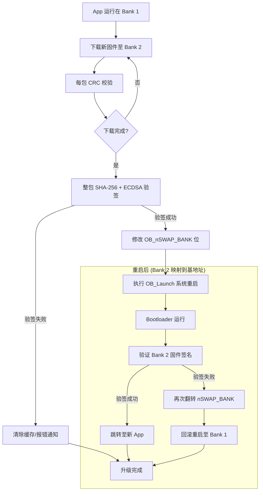
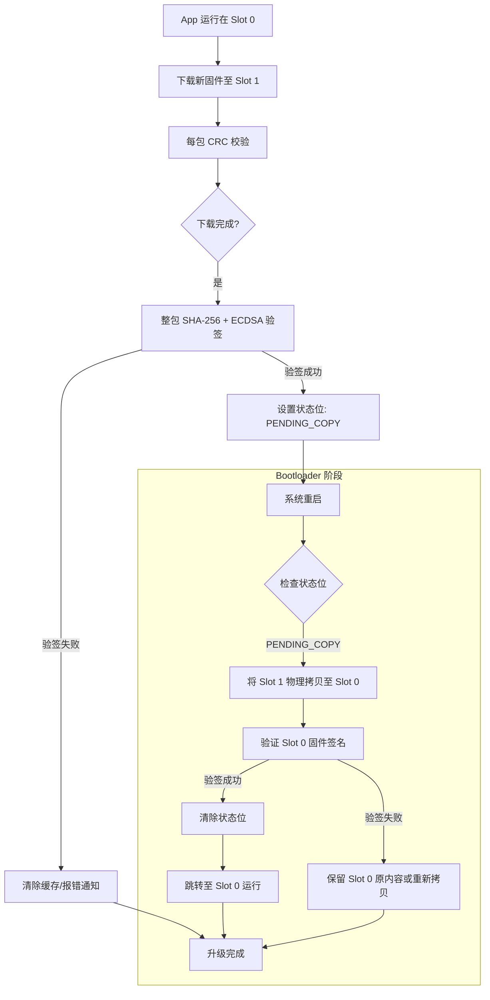
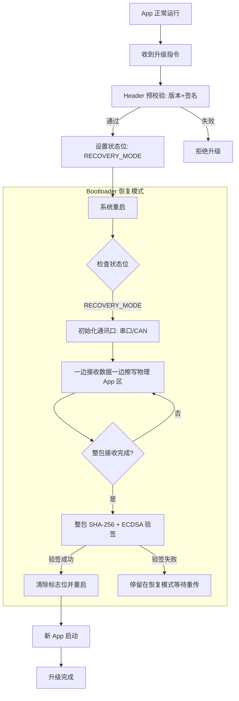

# 通用 MCU 安全升级库 - 详细需求规格书

> **项目名称**：Universal Secure OTA Library (smOTA)
> **目标平台**：通用 MCU 平台（支持 Cortex-M、RISC-V 等架构）
> **文档版本**：v1.2
> **编写日期**：2026-01-24

---

## 目录

0. [快速开始](#0-快速开始)
1. [项目概述](#1-项目概述)
2. [硬件环境参考](#2-硬件环境参考)
3. [核心升级策略](#3-核心升级策略)
4. [五大可靠性设计维度](#4-五大可靠性设计维度)
5. [固件包结构定义](#5-固件包结构定义)
6. [状态机设计](#6-状态机设计)
7. [软件架构设计](#7-软件架构设计)
8. [安全方案](#8-安全方案)
9. [三种升级模式详细设计](#9-三种升级模式详细设计)
10. [API 接口规范](#10-api-接口规范)
11. [上位机/服务器要求](#11-上位机服务器要求)
12. [开发者注意事项](#12-开发者注意事项)

---

## 相关文档

| 文档 | 说明 |
|:-----|:-----|
| [doc/1.project-structure.md](doc/1.project-structure.md) | 项目结构说明 |
| [doc/2.config-reference.md](doc/2.config-reference.md) | 配置参考 |
| [doc/3.key-management.md](doc/3.key-management.md) | 密钥管理 |
| [doc/4.ota-protocol.md](doc/4.ota-protocol.md) | OTA 升级协议规范 |

---

## 0. 快速开始

### 最小集成（3 步）

1. **复制 smota 文件夹到项目**
   ```
   YourProject/
   └── smota/          # 复制整个 smota 文件夹
   ```

2. **配置编译器**
   - 头文件路径：`smota`, `smota/smota_core/inc`, `smota/smota_hal/inc`
   - 源文件：`smota/smota_core/src/*.c` + 对应平台 HAL 文件

3. **调用 API**
   ```c
   
   ```

### 配置示例

```c
// 方式1：编译选项
// -DSMOTA_MODE_DUAL_BANK=1 -DSMOTA_RELIABILITY_SOURCE=1

// 方式2：自定义配置文件
// 编译时添加: -DSMOTA_USER_CONFIG_FILE=\"my_ota_config.h\"
```

> 详细集成指南请参考 [doc/1.project-structure.md](doc/1.project-structure.md#7-用户集成指南)

---

## 1. 项目概述

### 1.1 目标

开发一套轻量级、高度可靠且安全的 MCU 固件升级库，具备以下核心特性：

- **跨平台特性**：适配 STM32、RISC-V 等多种 MCU 架构
- **硬件抽象**：通过 HAL 接口层隔离硬件差异
- **高可靠性**：支持断电保护、固件回滚、多重校验
- **高安全性**：基于 ECDSA-P256 的固件签名验证

### 1.2 应用场景

- 物联网设备远程固件升级
- 工业控制设备固件维护
- 医疗器械固件升级
- 消费电子产品 OTA 更新

---

## 2. 硬件环境参考

### 2.1 通用要求

| 参数 | 说明 |
|:-----|:-----|
| **架构支持** | ARM Cortex-M、RISC-V 等通用 MCU 架构 |
| **Flash 容量** | 建议 ≥ 128KB（取决于应用大小和升级模式） |
| **RAM 容量** | 建议 ≥ 8KB（用于加解密和 Hash 计算缓冲区） |
| **Flash 结构** | 支持单分区或双分区（双 Bank 或双 Slot） |

### 2.2 内存布局示意

```
Flash 地址空间 (通用布局):
+------------------------+ 0x08000000 (或 MCU Flash 基地址)
|   Bootloader (8-16KB)  |
+------------------------+ (地址根据 Bootloader 大小调整)
|                        |
|   Bank 1 / Slot 0      |
|   (Primary App)        |
|                        |
+------------------------+ (地址根据 Flash 大小调整)
|                        |
|   Bank 2 / Slot 1      |
|   (Secondary App)      |
|   (可选，双分区模式)    |
|                        |
+------------------------+
```

**注**：具体地址配置需根据目标 MCU 的 Flash 大小和 Bootloader 占用空间进行调整。

---

## 3. 核心升级策略

库需适配以下三种物理布局：

| 模式 | 描述 | 安全等级 | 空间占用 | 适用场景 |
|:-----|:-----|:---------|:---------|:---------|
| **双 Bank 交换 (Dual-Bank)** | 利用硬件映射交换 Bank 1/2 | 极高 (支持回滚) | 50% App 空间 | 支持硬件交换的 MCU (如 G0, L4) |
| **双槽位搬运 (Dual-Slot)** | 软件 Slot 0/1，由 Bootloader 物理搬运 | 高 (支持回滚) | 50% App 空间 | 通用 Cortex-M 芯片 |
| **单分区覆盖 (In-place)** | 直接覆盖当前 App，无备份区 | 中 (不支持回滚) | ~90% App 空间 | Flash 极度受限设备 |

### 3.1 三种模式对比

| 维度 | 双 Bank 硬件交换 | 双槽位软件搬运 | 单槽位覆盖安装 |
|:-----|:-----------------|:---------------|:---------------|
| **Bootloader 职责** | 仅验证与确认映射 | 验证、**物理拷贝数据** | **实现通讯协议+擦写** |
| **断电安全性** | 极高（硬件保证） | 高（依赖拷贝原子性） | 低（写入中断会导致砖头） |
| **回滚能力** | 毫秒级回滚 | 需重新搬运回滚 | **无回滚能力** |
| **Flash 占用** | 50% 冗余 | 50% 冗余 | **0% 冗余** |
| **App 链接地址** | 0x08000000 (固定) | 0x08002000 (偏移) | 0x08002000 (偏移) |

---

## 4. 五大可靠性设计维度

### 4.1 运行可靠性 (Operational Reliability) 【必须】

**目标**：确保升级过程在异常情况下系统能够恢复或回滚。

**实现要求**：

| 场景 | 处理策略 |
|:-----|:---------|
| 正常升级完成 | 标记新固件为激活状态，跳转执行 |
| 升级中断（断电/网络故障） | 系统重启后自动回滚到旧版本 |
| 验签失败 | 拒绝升级，保留当前版本 |

**注**：本库作为独立的 Bootloader 实现，不侵入 App 代码，因此不实现新固件运行时的异常检测（如看门狗触发的回滚）。App 层的运行状态监控由应用层自行实现。

### 4.2 来源可靠性 (Source Reliability) 【可选】

**目标**：确保固件由唯一合法的私钥持有者签发。

**技术方案**：

- **非对称加密算法**：ECDSA-P256 (secp256r1)
- **验签流程**：
  1. 服务器端使用私钥对固件摘要（SHA-256）进行签名
  2. MCU 库内置**硬编码公钥**（`const uint8_t` 数组，配合 WRP 保护）
  3. Bootloader 在跳转 App 前，必须通过公钥验证签名的合法性

### 4.3 内容可靠性 (Content Reliability) 【必须】

**目标**：确保固件在传输与存储过程中未发生 1-bit 的逻辑错误。

**双重校验体系**：

```
传输层 (Packet Level)               应用层 (Image Level)
┌─────────────┐                    ┌─────────────┐
│ 每包数据    │                    │ 固件整体    │
│ + CRC-16    │                    │ SHA-256     │
└─────────────┘                    └─────────────┘
      ↓                                    ↓
接收端实时校验                      全量数据校验
      ↓                                    ↓
  失败立即重传                     比对 Header 中的 Hash
                                 ↓
                           确保 Flash 数据与原始一致
```

### 4.4 过程可靠性 (Transmission Reliability) 【可选】

**目标**：防止固件被黑客通过总线监听（UART/CAN/SPI）进行逆向工程。

**技术方案**：AES-128-CTR 对称加密 + 基于 HMAC-SHA256 的一机一密派生

**设计原则**：
- **对称加密（AES）**：用于固件数据加密，速度快，适合大数据量
- **非对称加密（ECDSA）**：仅用于签名验证，不用于数据加密
- **一机一密（KDF）**：每台设备派生专属密钥，单台泄露不影响全局

#### 4.4.1 密钥派生方案（一机一密）

```
┌─────────────────────────────────────────────────────────────┐
│                   密钥派生（主密钥不传播）                    │
├─────────────────────────────────────────────────────────────┤
│                                                             │
│   服务器                          MCU 设备                  │
│   ┌──────────┐                  ┌──────────┐               │
│   │ 主密钥   │                  │ 主密钥   │ ← 硬编码        │
│   │ (Master) │                  │ (Master) │   在双方代码中  │
│   └────┬─────┘                  └────┬─────┘               │
│        │                              │                     │
│        │         共享信息              │                     │
│        │◀═════════════════════════════▶│                     │
│        │      MCU UID (非密钥)          │                     │
│        │                              │                     │
│        ▼                              ▼                     │
│   ┌──────────┐                  ┌──────────┐               │
│   │  KDF     │                  │  KDF     │               │
│   │(HMAC-SHA)│                  │(HMAC-SHA)│               │
│   └────┬─────┘                  └────┬─────┘               │
│        │                              │                     │
│        ▼                              ▼                     │
│   ┌──────────┐                  ┌──────────┐               │
│   │设备密钥  │                  │设备密钥  │ ← 派生出来     │
│   │Device Key│                  │Device Key│   完全相同！   │
│   └──────────┘                  └──────────┘               │
│                                                             │
│   主密钥永远不传播！双方用相同的算法 + 相同的输入 → 相同的输出 │
└─────────────────────────────────────────────────────────────┘
```

#### 4.4.2 密钥派生实现

```c
/**
 * 派生设备专属密钥
 *
 * @param master_key   16字节主密钥（服务器和所有设备共享，硬编码）
 * @param mcu_uid      MCU唯一ID（长度因MCU而异）
 * @param uid_len      UID长度（字节）
 * @param device_key   输出16字节设备专属密钥
 */
void OTA_DeriveDeviceKey(const uint8_t *master_key,
                         const uint8_t *mcu_uid,
                         uint32_t uid_len,
                         uint8_t *device_key) {

    // 方案：HMAC-SHA256(master_key, mcu_uid || context_string)
    // 取前16字节作为 AES-128 密钥
    //
    // context_string 可以是 "smOTA_Enc_v1" 等固定字符串，
    // 用于不同用途的密钥派生隔离

    uint8_t hash[32];
    uint8_t kdf_input[64];

    // 拼接 UID + 上下文字符串
    memcpy(kdf_input, mcu_uid, uid_len);
    memcpy(kdf_input + uid_len, "smOTA_Enc_v1", 12);

    hmac_sha256(master_key, 16, kdf_input, uid_len + 12, hash);
    memcpy(device_key, hash, 16);
}
```

**UID 来源示例**：
- STM32: `UID[3]` = 96-bit 唯一 ID（地址 0x1FFFF7E8）
- GD32: 类似
- ESP32: MAC 地址衍生的

#### 4.4.3 完整加解密流程

```
┌─────────────────────────────────────────────────────────────────────┐
│                        服务器端                                     │
│  ┌──────────┐    ┌──────────┐    ┌──────────┐    ┌──────────┐     │
│  │ 原始固件 │───▶│ SHA-256  │───▶│ AES-CTR  │───▶│  分包    │     │
│  │ .bin     │    │ (计算Hash)│    │ (加密)   │    │  发送    │     │
│  └──────────┘    └──────────┘    └──────────┘    └──────────┘     │
│       │                                                   │        │
│       ▼                                                   ▼        │
│  Hash: 0x1234...ab                                加密数据包        │
│                                                      通过网络        │
└─────────────────────────────────────────────────────────────────────┘
                                                               │
                                                               ▼
┌─────────────────────────────────────────────────────────────────────┐
│                        MCU 端                                      │
│  ┌──────────┐    ┌──────────┐    ┌──────────┐    ┌──────────┐     │
│  │ 接收     │───▶│ AES-CTR  │───▶│ SHA-256  │───▶│ 写Flash  │     │
│  │ 加密包   │    │ (解密)   │    │ (验证)   │    │          │     │
│  └──────────┘    └──────────┘    └──────────┘    └──────────┘     │
│                                                                 ▲   │
│                        密钥派生                                    │   │
│  ┌──────────┐    ┌──────────┐    ┌──────────┐                   │   │
│  │ 主密钥   │ +  │ MCU UID  │ ──▶│ KDF      │───设备密钥───────┘   │
│  │ (硬编码) │    │ (96位)   │    │ (HMAC)   │                       │
│  └──────────┘    └──────────┘    └──────────┘                       │
└─────────────────────────────────────────────────────────────────────┘
```

#### 4.4.4 流式解密实现（低 RAM 场景）

```c
// 适用于 RAM < 2KB 的流式解密
#define DECRYPT_BUF_SIZE 1024

void OTA_DecryptStream(const uint8_t *cipher, uint32_t len,
                       uint32_t packet_index, uint32_t flash_offset) {

    static uint8_t decrypt_buf[DECRYPT_BUF_SIZE];

    // 设置 CTR 计数器（每个包不同）
    uint8_t nonce[16];
    memset(nonce, 0, 16);
    memcpy(nonce, "smOTA", 6);           // 固定前缀
    memcpy(nonce + 6, &packet_index, 4); // 包序号

    aes_ctr_init(&aes_ctx, device_key, nonce);

    // 分块解密 + 立即写 Flash
    for (uint32_t i = 0; i < len; i += DECRYPT_BUF_SIZE) {
        uint32_t chunk = MIN(DECRYPT_BUF_SIZE, len - i);

        // 解密（CTR 模式下，解密 = 加密）
        aes_ctr_update(&aes_ctx, cipher + i, decrypt_buf, chunk);

        // 边解密边计算 Hash
        sha256_update(&hash_ctx, decrypt_buf, chunk);

        // 立即写 Flash
        flash_write(flash_offset + i, decrypt_buf, chunk);
    }
}
```

#### 4.4.5 分发优势

| 优势 | 说明 |
|:-----|:-----|
| **抗监听** | 总线上的数据包针对每台设备唯一，截获 A 设备包无法破解 B 设备 |
| **逻辑隔离** | 即便单台设备被攻破提取了 `Device_Key`，也不会导致全线产品泄密 |
| **无需密钥传输** | 主密钥不传播，通过派生算法在设备本地生成设备专属密钥 |
| **支持流式处理** | AES-CTR 模式支持边下载边解密边写 Flash，RAM 占用小 |

### 4.5 版本可靠性 (Version Reliability) 【可选】

**目标**：防止黑客通过重放（Replay）带有已知漏洞的旧版合法固件来攻击系统。

**防回滚机制 (Anti-Rollback)**：

```c
typedef struct {
    uint8_t major;
    uint8_t minor;
    uint8_t patch;
} FirmwareVersion_t;

// 版本比较逻辑
if (!(new_version > current_version || emergency_force_upgrade)) {
    return ERROR_VERSION_ROLLBACK;
}
```

---

## 5. 固件包结构定义

### 5.1 整体格式

```
+------------------+
|   Header         |  固定 128-256 Bytes
+------------------+
|   Payload        |  原始 .bin 固件数据
|   (可加密)       |
+------------------+
```

### 5.2 Header 结构定义

```c
#pragma pack(push, 1)

typedef struct {
    // Magic Word (4 Bytes): 0xAA, 0x55, 0xAA, 0x55
    uint8_t  magic[4];

    // 版本信息 (3 Bytes)
    uint8_t  version_major;
    uint8_t  version_minor;
    uint8_t  version_patch;

    // 固件信息
    uint32_t firmware_size;        // Payload 实际大小
    uint32_t firmware_crc;         // CRC-32 校验（可选）

    // 安全信息
    uint8_t  sha256_hash[32];      // 固件 SHA-256 摘要

    // ECDSA 签名 (64 Bytes)
    uint8_t  signature_r[32];
    uint8_t  signature_s[32];

    // 标志位
    uint16_t flags;                // bit0: 是否加密, bit1: 是否启用防回滚
    uint16_t header_crc;           // Header 自身的 CRC-16

    // 保留字段（填充至 256 Bytes）
    uint8_t  reserved[144];

} OTA_PackageHeader_t;

#pragma pack(pop)
```

---

## 6. 状态机设计

### 6.1 核心状态定义

```c
typedef enum {
    OTA_STATE_IDLE,           // 正常运行
    OTA_STATE_DOWNLOADING,    // 分包接收中
    OTA_STATE_VERIFYING,      // 验签中
    OTA_STATE_ACTIVATING,     // 激活中
    OTA_STATE_ERROR           // 错误状态
} OTA_State_t;
```

### 6.2 状态转换图

```
                    ┌─────────────┐
                    │    IDLE     │ ◄─────────────┐
                    └──────┬──────┘               │
                           │                      │
              收到升级指令 │                      │ 升级失败
                           ▼                      │
                    ┌─────────────┐               │
            ┌──────▶│ DOWNLOADING │───────┐       │
            │       └──────┬──────┘       │       │
            │              │ 下载完成     │       │
            │              ▼              │       │
            │       ┌─────────────┐       │       │
            │       │  VERIFYING  │◄──────┘       │
            │       └──────┬──────┘  验签失败     │
            │              │ 验签成功              │
            │              ▼                      │
            │       ┌─────────────┐               │
            └───────│ ACTIVATING  │───────────────┤
                    └──────┬──────┘               │
                           │ 重启并跳转           │
                           ▼                      │
                    ┌─────────────┐               │
                    │   IDLE      │ ──────────────┘
                    │  (新固件)   │
                    └─────────────┘
```

---

## 7. 软件架构设计

### 7.1 分层架构

```
┌─────────────────────────────────────────────────┐
│           Application (用户应用)                 │
├─────────────────────────────────────────────────┤
│         OTA Library (核心库)                    │
│  ┌──────────┐  ┌──────────┐  ┌──────────┐      │
│  │ 状态机   │  │ 包解析   │  │ 验签模块 │      │
│  └──────────┘  └──────────┘  └──────────┘      │
├─────────────────────────────────────────────────┤
│         HAL Interface (硬件抽象层)               │
│  ┌──────────────────────────────────────────┐  │
│  │ flash_write / flash_erase / reset       │  │
│  └──────────────────────────────────────────┘  │
├─────────────────────────────────────────────────┤
│         Crypto Engine (加密引擎)                 │
│  ┌──────────┐  ┌──────────┐  ┌──────────┐      │
│  │ SHA-256  │  │ ECDSA    │  │ AES-128  │      │
│  └──────────┘  └──────────┘  └──────────┘      │
├─────────────────────────────────────────────────┤
│         MCU Hardware (底层硬件)                  │
└─────────────────────────────────────────────────┘
```

### 7.2 HAL 接口定义

```c
/**
 * OTA 硬件抽象层接口
 * 用户需根据具体 MCU 实现这些函数指针
 */
typedef struct {

    // ========================================================================
    // Flash 操作接口
    // ========================================================================

    /**
     * Flash 写入
     * @param addr 目标地址
     * @param buf   数据缓冲区
     * @param len   数据长度
     * @return      0=成功, 负值=错误码
     */
    int (*flash_write)(uint32_t addr, const uint8_t *buf, uint32_t len);

    /**
     * Flash 擦除
     * @param addr        起始地址
     * @param page_count  页数量
     * @return            0=成功, 负值=错误码
     */
    int (*flash_erase)(uint32_t addr, uint32_t page_count);

    /**
     * Flash 读取
     * @param addr 目标地址
     * @param buf   数据缓冲区
     * @param len   数据长度
     * @return      0=成功, 负值=错误码
     */
    int (*flash_read)(uint32_t addr, uint8_t *buf, uint32_t len);

    // ========================================================================
    // 系统控制接口
    // ========================================================================

    /**
     * 系统复位
     */
    void (*system_reset)(void);

    /**
     * 看门狗喂狗 (长时间操作时调用)
     */
    void (*watchdog_feed)(void);

    // ========================================================================
    // 模式特定接口 (根据升级模式选择性实现)
    // ========================================================================

    /**
     * 设置 Bank 交换 (仅双 Bank 模式需要)
     * @return 0=成功, 负值=错误码
     */
    int (*set_swap_bank)(void);

    /**
     * 获取当前运行槽位 (仅双槽位模式需要)
     * @return 0=Slot 0, 1=Slot 1, 负值=错误
     */
    int (*get_active_slot)(void);

    // ========================================================================
    // 加解密接口 (根据安全需求选择性实现)
    // ========================================================================

    /**
     * AES-128 初始化 (用于过程可靠性 - 固件加密传输)
     * @param key        16字节 AES 密钥
     * @param iv         16字节初始化向量 (CBC 模式) 或 NULL (CTR/ECB 模式)
     * @param mode       加密模式: 0=ECB, 1=CBC, 2=CTR
     * @param encrypt    true=加密, false=解密
     * @return           0=成功, 负值=错误码
     */
    int (*crypto_aes_init)(const uint8_t *key, const uint8_t *iv, int mode, bool encrypt);

    /**
     * AES-128 加密/解密 (用于过程可靠性 - 固件加密传输)
     * @param input      输入数据
     * @param output     输出数据
     * @param len        数据长度 (必须是 16 字节的倍数)
     * @return           0=成功, 负值=错误码
     */
    int (*crypto_aes_update)(const uint8_t *input, uint8_t *output, uint32_t len);

    /**
     * 计算 SHA-256 摘要 (用于内容可靠性)
     * @param data       输入数据
     * @param len        数据长度
     * @param hash       输出 32 字节摘要
     * @return           0=成功, 负值=错误码
     */
    int (*crypto_sha256)(const uint8_t *data, uint32_t len, uint8_t *hash);

    /**
     * ECDSA-P256 验签 (用于来源可靠性)
     * @param hash       32字节 SHA-256 摘要
     * @param signature  64字节签名 (r + s, 各32字节)
     * @param public_key 64字节公钥 (未压缩格式 x + y, 各32字节)
     * @return           0=验签成功, 负值=验签失败
     */
    int (*crypto_ecdsa_verify)(const uint8_t *hash, const uint8_t *signature,
                               const uint8_t *public_key);

} OTA_Hardware_Interface_t;
```

### 7.3 推荐加密库

**TinyCrypt (Intel)**

| 特性 | 说明 |
|:-----|:-----|
| 语言 | 纯 C 实现 |
| 内存 | 无 `malloc`，静态分配 |
| 体积 | 代码控制在 10KB 以内 |
| 支持算法 | SHA-256, ECDSA-P256, AES-128 |

---

## 8. 安全方案

### 8.1 根信任架构

```
┌─────────────────────────────────────────────────┐
│                  安全链路                        │
├─────────────────────────────────────────────────┤
│                                                 │
│  ┌─────────┐      私钥签名      ┌──────────┐   │
│  │  服务器 │ ────────────────▶ │ 固件包   │   │
│  └─────────┘                    └──────────┘   │
│                                         │       │
│                                   传输/加密      │
│                                         │       │
│                                         ▼       │
│  ┌─────────┐      公钥验签      ┌──────────┐   │
│  │   MCU   │ ◀─────────────── │Bootloader│   │
│  └─────────┘                    └──────────┘   │
│     (硬编码公钥 + WRP 保护)                     │
└─────────────────────────────────────────────────┘
```

### 8.2 密钥管理

| 组件 | 存储位置 | 保护方式 |
|:-----|:---------|:---------|
| **私钥** | 离线签名服务器 | 物理隔离，永不进入 MCU |
| **公钥** | Bootloader 源码 | 硬编码 + WRP 写保护 + RDP Level 1 |
| **AES 密钥** | 可选：Flash 或派生 | UID 派生或安全存储区 |

### 8.3 安全建议

1. **公钥混淆**：不要将公钥以纯 64 字节数组形式存放，应进行 XOR 混淆或拆分存储，防止特征码扫描
2. **关键标志位原子性**：操作 Flash 状态标志位时，确保有掉电保护逻辑
3. **资源开销**：验签过程应尽快完成，避免影响启动体验
4. **看门狗处理**：长时间操作（如验签、搬运）需定期喂狗

---

## 9. 三种升级模式详细设计

### 9.1 双 Bank 硬件交换模式 (Dual-Bank Swap)

**适用场景**：支持硬件 Bank 交换的 MCU

**特点**：硬件直接对调地址映射，无需物理搬运，升级速度最快

#### 流程图



---

### 9.2 双槽位软件搬运模式 (Dual-Slot Copy)

**适用场景**：Flash 较大但不支持硬件交换的 MCU

**特点**：App 存在 Active 区，备份存在 Secondary 区，由 Bootloader 执行物理拷贝

#### 流程图



---

### 9.3 单槽位覆盖模式 (Single-Slot In-place)

**适用场景**：Flash 空间紧缺（无法存放两份 App）的 MCU

**特点**：App 触发重启，Bootloader 接管通讯并直接覆盖写入

#### 流程图




## 附录 A：版本历史

| 版本 | 日期 | 变更说明 |
|:-----|:-----|:---------|
| v1.0 | 2026-01-24 | 初始版本 |
| v1.1 | 2026-01-24 | 1. 新增加解密接口到 HAL 定义<br>2. 移除具体硬件型号参考，改为通用 MCU 平台<br>3. 移除新固件运行异常回滚需求（不侵入 App） |
| v1.2 | 2026-01-24 | 1. 细化过程可靠性设计，增加一机一密（基于 HMAC-SHA256 的密钥派生）方案<br>2. 增加 AES-CTR 对称加密的完整流程说明<br>3. 增加流式解密实现示例（适用于低 RAM 场景） |

---

**文档结束**
