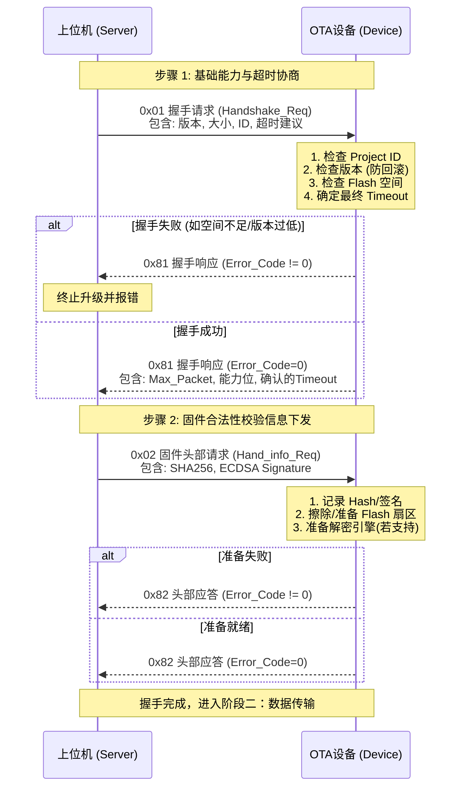
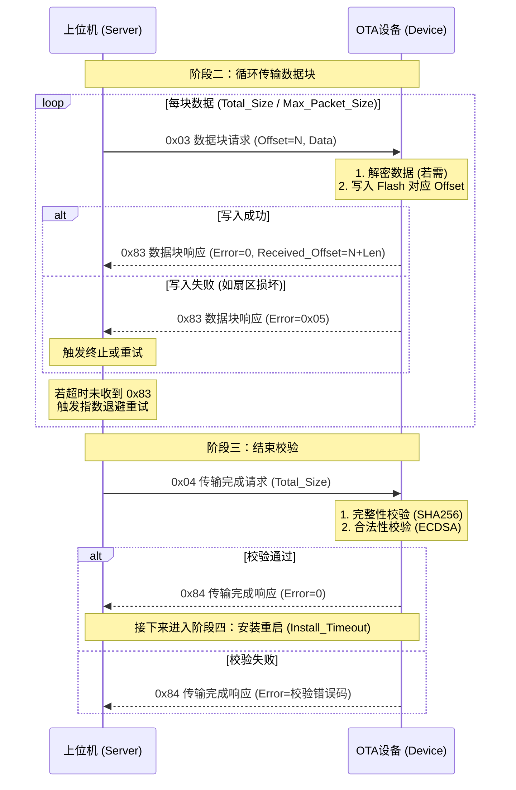
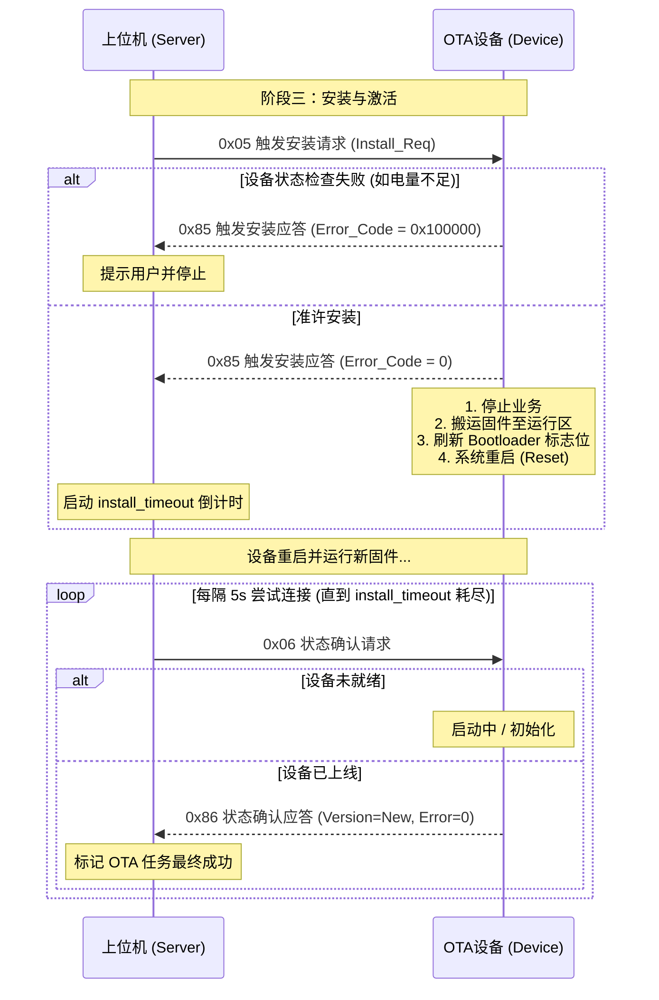

# smOTA 升级协议规范

> **文档版本**: v1.0
> **编写日期**: 2026-01-26
> **协议版本**: 0x01

---

## 目录

0. [协议概述](#0-协议概述)
1. [阶段一：握手阶段](#1-阶段一握手阶段)
2. [阶段二：传输阶段](#2-阶段二传输阶段)
3. [阶段三：升级完成阶段](#3-阶段三升级完成阶段)

---

## 0. 协议概述

本协议定义了 smOTA 固件升级的完整通信规范。

### 0.1 协议阶段划分

```
┌─────────────────────────────────────────────────────────────────┐
│                        smOTA 升级流程                           │
├─────────────────────────────────────────────────────────────────┤
│                                                                 │
│  ┌─────────────┐    ┌─────────────────────┐    ┌─────────────┐ │
│  │  阶段一     │───▶│      阶段二         │───▶│   阶段三     │ │
│  │  握手阶段   │    │    传输阶段         │    │ 升级完成    │ │
│  │             │    │  (大量固件数据)     │    │             │ │
│  └─────────────┘    └─────────────────────┘    └─────────────┘ │
│                                                                 │
└─────────────────────────────────────────────────────────────────┘
```

| 阶段 | 说明 | 主要命令 |
|:-----|:-----|:---------|
| 阶段一 | 握手阶段 | 协商传输参数、验证设备能力 |
| 阶段二 | 传输阶段 | 分包传输固件数据、重传控制 |
| 阶段三 | 升级完成阶段 | 验签、激活、重启 |

### 0.2 协议层次

```
┌─────────────────────────────────────────┐
│         应用层协议 (smOTA Protocol)      │
├─────────────────────────────────────────┤
│         传输层 (UART / CAN / BLE / ...)  │
├─────────────────────────────────────────┤
│         物理层                           │
└─────────────────────────────────────────┘
```

### 0.3 设计原则

| 原则 | 说明 |
|:-----|:-----|
| **简单高效** | 数据包结构紧凑，适合低带宽场景 |
| **可靠性** | 双重校验（包级 CRC + 整包 SHA-256） |
| **安全性** | 支持 ECDSA 签名验证 + AES 加密传输 |
| **可扩展** | 预留扩展字段 |

### 0.4 smFrame 通用帧结构

所有阶段使用统一的帧格式，称为 **smFrame**。统一使用小端传输。

#### 0.4.1 字段定义

| 偏移 | 字段 | 长度 | 说明 |
|:-----|:-----|:-----|:-----|
| 0 | SOF | 5 | 帧起始符，固定为 "smOTA" |
| 5 | Ver | 1 | 协议版本，当前为 0x00 |
| 6    | Frag    | 1    | 详见0.4.2 分片控制（当前版本暂时不支持）                     |
| 7    | Seq     | 2    | 帧序号 0-65535，循环使用，用于检测丢包或乱序                 |
| 9    | Cmd     | 1    | 命令码，详见 0.5 节                                          |
| 10 | Length  | 2    | Payload 长度（小端），最大可配置                             |
| N    | Payload | N    | 实际数据                                                     |
| 12+N | CRC16   | 2    | 针对整个帧（SOF 到 Payload 结束）的 CRC-16 校验，初始值 0xFFFF，多项式 0x1021 |

#### 0.4.2 分片控制字段 (Frag 暂时不支持)

分片功能用于当单帧数据超过传输层 MTU 时，将完整帧拆分为多个小片段传输。

| Bit (7-0) | 名称 | 说明 |
|:----------|:-----|:-----|
| 7 | FRAG_EN | 分片使能标志，1=启用分片，0=非分片帧 |
| 6 | FRAG_MORE | 后续分片标志，1=后续还有分片，0=最后一个分片 |
| 5-0 | FRAG_TOTAL | 分片总数（0-63），完整帧被拆分的总片段数 |


### 0.5 命令码定义

所有阶段的命令码统一分配：

| 命令码 | 名称 | 方向 | 阶段 | 说明 |
|:------|:-----|:-----|:-----|:-----|
| 0x01 | CMD_HANDSHAKE | Server → Device | 握手 | 握手请求 |
| 0x02 | CMD_HEADER_INFO | Server → Device | 握手 | 发送固件头部信息 |
| 0x03 | CMD_DATA_BLOCK | Server → Device | 传输 | 发送数据包 |
| 0x04 | CMD_DATA_COMPLETE | Server → Device | 传输 | 数据包传输完毕 |
| 0x05 | CMD_VERIFY | Device → Server | 完成 | 开始下载 |
| 0x06      | CMD_ACTIVATE      | Server → Device | 完成 | 激活完成           |
|           |                   |                 |      |                    |
|           |                   |                 |      |                    |
|           |                   |                 |      |                    |
| CMD\|0x80 | 应答              |                 |      | 应答标志位(D7置位) |

### 0.6 通用错误码定义

所有阶段的应答包中，第一个成员变量`UINT32`为通用错误码，0为所有检查通过，32个bit代表可以支持32种错误。

| 状态码 | 名称                        | 说明                                                 |
| :----- | :-------------------------- | :--------------------------------------------------- |
| bit0   | CONNECT_PROTOCOL_MISMATCH   | 协议版本不匹配                                       |
| bit1   | CONNECT_PROJECT_ID_MISMATCH | 项目 ID 不匹配                                       |
| bit2   | CONNECT_VERSION_MISMATCH    | 版本不匹配（开启防回滚，并且当前版本大于下发的版本） |
| bit3   | CONNECT_FLASH_INSUFFICIENT  | Flash 空间不足                                       |
|        |                             |                                                      |
|        |                             |                                                      |
| bit8   | DATA_AES_                   | AES解密错误                                          |
| bit9   |                             | FLASH写入错误                                        |
| bit16  |                             |                                                      |
|        |                             |                                                      |
|        |                             |                                                      |
|        |                             |                                                      |
|        |                             |                                                      |
|        |                             |                                                      |
|        |                             |                                                      |
|        |                             |                                                      |
|        |                             |                                                      |
|        |                             |                                                      |
|        |                             |                                                      |


---

## 1. 阶段一：握手阶段

握手阶段需要协商的内容如下：

**protocol_version：**握手阶段的版本号不一致可以通讯，上位机需要根据应答的版本号，进行版本后退处理。例如新版本中支持差分升级，但是设备版本不支持。那么就要按设备版本为主，不能进行差分。

**max_packet_size：**一包数据的大小，(建议和Flash页大小一致)。

**mtu szie：**如果max_packet_size大于 MTU，则上位机需要进行分片发送，单片机需要分片接收。（暂不支持）

**fw_version：**固件版本号，如果设备使能了防回滚，需要判断设备的版本号。

**timeout_ms：**数据超时、安装超时。由上位机给出建议值，最后实际值按照ota设备上报的为准。数据超时后，上位机进行指数退避**block_timeout * 2^(n-1)+rand(block_timeout/10)**。超过3次后认为设备离线。

**capabilities：**设备能力值。告诉上位机设备支持哪些能力。上位机根据能力值来下发对应的加密报文。

**nextoffset：**用于断点续传，如果设备拥有持**久化存储当前的进度**的能力，向上位机上报当前进度。

> **通信帧格式**：本阶段所有数据包均使用 [0.4 smFrame 通用帧结构](#04-smframe-通用帧结构)，本阶段所展示的C语言结构体为通用帧结构里面的Payload字段。
>
> Payload字段如何解析与协议的版本挂钩。协议版本字节只有单字节，考虑到BootLoader定下之后也不会频繁修改，单字节应该够用了。

### 1.1 握手请求

#### 1.1.1 握手请求 (Server → Device)（命令码 0x01）

```c
typedef struct {
    uint8_t  fw_version_major;      // 固件主版本号
    uint8_t  fw_version_minor;      // 固件次版本号
    uint8_t  fw_version_patch;      // 固件补丁版本号
    uint32_t firmware_size;			// 固件大小
    uint8_t project_id[16];			// 设备id
    uint16_t block_timeout;			// 数据超时建议值(ms)。单个数据包往返时间，根据实际的网络环境调整。
    uint16_t check_timout;			// 校验超时建议值(ms)。固件进行签名验证时的超时时间。
    uint16_t install_timeout;       // 安装超时建议值(ms)。设备将固件从下载区搬运到执行区的时间。
    uint32_t total_timeout;			// 总超超时建议值(ms)。
} Handshake_Req_t;
```

#### 1.1.2 握手响应 (Device → Server)（命令码 0x81）

```c
typedef struct {
    uint32_t error_code;			// 通用应答错误码
    uint32_t next_offset;			// 用于断点续传
    uint16_t max_packet_size;       // 设备实际支持的最大包长度
    uint16_t mtu_size;				// 设备物理支持最大MTU长度
    uint32_t flash_free_size;       // 可用 Flash 空间
    uint16_t block_timeout;			// 数据超时建议值 (ms)。单个数据包往返时间，根据实际的网络环境调整。
    uint16_t install_timeout;       // 安装超时建议值 (ms)。设备将固件从下载区搬运到执行区的时间。
    uint8_t  capabilities;          // 设备能力标志位
} Handshake_Resp_t;
```

#### 1.1.3 设备能力标志位

| Bit | 名称 | 说明 |
|:----|:-----|:-----|
| 0 | CAP_SIGNATURE | 支持 ECDSA 签名验证 |
| 1 | CAP_ENCRYPT | 支持 AES 解密 |
| 2 | CAP_ANTI_ROLLBACK | 支持防回滚 |
| 3-7 | RESERVED | 保留位 |


### 1.2 发送固件头部信息

根据之前协商的能力位，生成对应的密钥下发。格式固定如下，如果对应加密都不支持的话，下发的密钥为0。设备根据自己的能力，忽略对应的密钥即可。

#### 1.2.1 发送固件头部请求(Server → Device)（0X02）

```c
typedef struct {
    uint8_t  sha256_hash[32];       // 固件 SHA-256 摘要
    uint8_t  signature_r[32];       // ECDSA 签名 r 分量
    uint8_t  signature_s[32];       // ECDSA 签名 s 分量
} Hand_info_Req_t;
```

#### 1.2.2 发送固件头应答(Device → Server)（0X82）

```c
typedef struct {
    uint32_t error_code;
} Hand_info_Resq_t;
```

### 1.3 握手阶段流程图




## 2. 阶段二：传输阶段

传输阶段负责将固件数据分包传输到设备。针对弱网设备，支持断点续传能力。

应答包里面的offset可以用于断点续传。

### 2.1 数据块传输

#### 2.1.1  数据块传输请求 (Server → Device)（命令码 0x03）

```c
typedef struct {
    uint32_t offset;                 // 在固件中的字偏移（除了最后一包以外，应该为package_max_size的整数倍）
    uint16_t length;                 // 数据长度
    uint8_t  data[0];				 // 根据协商的package_max_size
} Data_Block_Req_t;
```

#### 2.1.2 数据块传输响应 (Device → Server)（命令码 0x83）

```c
#pragma pack(push, 1)
typedef struct {
    uint32_t error_code;            // 写入结果
    uint32_t received_offset;       // 设备确认已成功写入的偏移量（用于断点续传和验证）
} Data_Block_Resp_t;
#pragma pack(pop)
```

### 2.2 数据块验证

此时超时时间为**check_timeout**

#### 2.2.1 数据块验证请求(Server → Device)（命令码 0x04）

```c
typedef struct {
    uint32_t total_size;            // 再次确认总大小，防止漏包
} Transfer_Complete_Req_t;
```

#### 2.2.2 数据块验证应答(Device → Server)（命令码 0x84）

这个是一个耗时的响应，设备接收到0X04之后，会执行以下三个操作：

- 计算下载区数据的SHA256

- 使用签名进行验证

- 验证通过后，返回结果

```C
#pragma pack(push, 1)
typedef struct {
    uint32_t error_code;
} Transfer_Complete_Resp_t;
#pragma pack(pop)
```

### 2.3 传输阶段流程图




---

## 3. 阶段三：安装与激活阶段

在阶段二（0x04/0x84）完成后，固件已安全存储在下载区并通过了完整性与合法性校验。阶段三负责触发物理安装、系统重启以及最终的版本确认。

### 3.1 触发安装请求 (Server → Device)（命令码 0x05）

上位机发送此指令，告知设备可以开始将固件从下载区搬运（Copy/Swap）到执行区。smOTA支持静默下载，也就是下载和安装的分开来执行的。例如在设备运行时进行下载，但是安装选择在设备空闲时安装（例如服务器在凌晨2点下发安装指令，当然用户也可以实现自己的安装逻辑）

注意：只有支持双bank机制的芯片，才能read while write，对于单bank的型号在写入Flash时，会强制锁死Flash总线。所以无法进行静默下载。

```c
typedef struct {
    uint8_t  force_install;         // 强制安装标志：0-正常安装；1-忽略电量等非关键约束强制执行
    uint16_t reserved;              // 预留
} Install_Req_t;
```

### 3.2 触发安装应答 (Device → Server)（命令码 0x85）

设备收到指令后，检查当前系统状态（如电池电量、工作模式），确认是否可以立即进入安装流程。

```c
typedef struct {
    uint32_t error_code;            // 0: 成功，即将开始安装并重启; bit20: 电量过低; bit21: 正在执行关键业务
    uint16_t estimated_time_s;      // 设备预估安装并重启所需的实际秒数
} Install_Resp_t;
```

> **注意**：一旦上位机收到 `error_code == 0` 的应答，应立即停止所有通信，并启动 `install_timeout` 计时器。在此期间，设备通常会关闭通讯外设进行 Flash 搬运并重启。

### 3.3 升级状态确认 (Server → Device)（命令码 0x06）

设备重启并进入新 App 后，上位机需再次发起握手或特定的状态查询，以确认升级最终成功。

#### 3.3.1 状态确认请求 (0x06)

```c
typedef struct {
    uint32_t task_id;               // 升级任务ID（可选）
} Activate_Check_Req_t;
```

#### 3.3.2 状态确认应答 (0x86)

```c
typedef struct {
    uint32_t error_code;            // 0: 升级成功并已运行新版本
    uint8_t  fw_version_major;      // 当前运行的实际主版本号
    uint8_t  fw_version_minor;
    uint8_t  fw_version_patch;
} Activate_Check_Resp_t;
```

---

### 3.4 升级完成阶段流程图



---

### 3.5 通用错误码补充 (Error Code Definitions)

在 `0.6 节` 的错误码表中增加安装阶段相关的 bit 位：

| 状态码    | 名称                       | 说明                                     |
| :-------- | :------------------------- | :--------------------------------------- |
| **bit17** | **VERIFY_SHA256_FAILED**   | SHA256 校验不匹配                        |
| **bit18** | **VERIFY_SIGN_FAILED**     | ECDSA 签名验证未通过                     |
| **bit19** | **INSTALL_FLASH_READ_ERR** | 从下载区读取数据失败                     |
| **bit20** | **INSTALL_LOW_BATTERY**    | 电池电量过低，禁止安装                   |
| **bit21** | **INSTALL_BUSY**           | 设备处于关键业务状态，无法重启           |
| **bit22** | **INSTALL_VERSION_OLD**    | 安装后检测版本号未按预期更新（回滚发生） |

---

## 4. 异常处理总结 (Timeout & Retry Summary)

为了确保规范落地，上位机在实现逻辑时应遵循下表：

| 异常情况         | 判断准则               | 处理动作                                                  |
| :--------------- | :--------------------- | :-------------------------------------------------------- |
| **握手超时**     | 超过 `block_timeout`   | 指数退避重试，最大 3 次                                   |
| **传输包超时**   | 超过 `block_timeout`   | 指数退避重试，最大 3 次；若仍失败记录当前 `offset` 并断开 |
| **校验等待超时** | 超过 `check_timeout`   | 发起 0x04 查询请求，若设备无响应则判定校验失败            |
| **安装重启超时** | 超过 `install_timeout` | 判定为升级失败（可能变砖或回滚），触发人工介入报警        |
| **断点恢复**     | 再次握手成功           | 上位机对比 0x81 中的 `next_offset` 与本地进度，跳转发送   |

---

### 补充建议：
1. **关于 0x04 的 check_timeout**：对于 1MB 以上的固件，SHA256 + ECDSA 验签在一些低主频单片机（如 M3 内部 Flash）上可能需要 **3-10 秒**。请务必在握手阶段给予足够的建议值。
2. **防回滚逻辑**：建议在 0x85（触发安装）前再次进行版本比对，防止在断点续传期间服务器下发了错误的老版本固件。

**smOTA 协议规范结束**


---

**文档结束**
