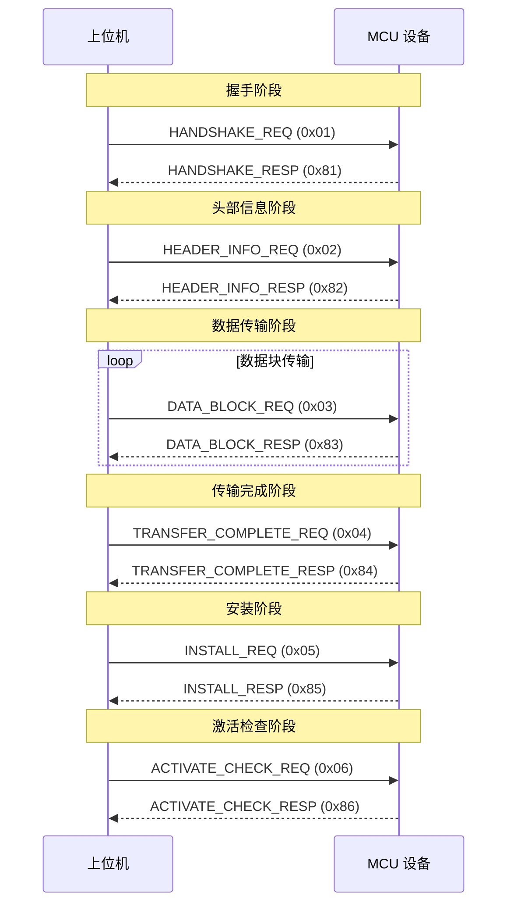

# SMOTA 协议数据结构设计文档

## 1. 模块概述

### 1.1 功能描述

本模块定义 SMOTA OTA 协议的完整数据结构，包括协议帧格式、命令码定义、请求/响应结构体，确保上位机与 MCU 设备之间的通信正确性和完整性。

### 1.2 设计目标

- **完整性**: 覆盖所有协议命令的请求和响应
- **兼容性**: 与现有 `smota_handler.c` 实现保持兼容
- **可扩展性**: 预留保留字段用于未来扩展
- **标准化**: 遵循 POSIX 结构体命名规范（使用 `struct xxx` 形式）

### 1.3 依赖模块

- `smota_types.h` - 基础类型定义
- `smota_config.h` - 配置参数
- `smota_handler.c` - 协议处理实现

---

## 2. 架构设计

### 2.1 模块结构

```
smota_core/
├── inc/
│   ├── smota_packet.h      # 协议包结构定义（主要文件）
│   └── smota_protocol.h    # 协议常量定义（新增）
└── src/
    └── smota_packet.c      # 协议包解析实现
```

### 2.2 层次结构

```
┌─────────────────────────────────────┐
│        应用层 (smota_handler)        │
├─────────────────────────────────────┤
│        协议层 (smota_packet)         │  ← 本模块
├─────────────────────────────────────┤
│        传输层 (comm_driver)          │
└─────────────────────────────────────┘
```

---

## 3. API 接口

### 3.1 协议包构建接口

```c
/**
 * @brief  构建待发送的协议帧
 * @param  cmd: 命令码
 * @param  payload: 负载数据
 * @param  payload_len: 负载长度
 * @param  buffer: 输出缓冲区
 * @param  buffer_size: 缓冲区大小
 * @return 0=成功, <0=失败
 */
int smota_frame_build(uint8_t cmd,
                      const uint8_t *payload,
                      uint16_t payload_len,
                      uint8_t *buffer,
                      uint16_t buffer_size);
```

### 3.2 协议包解析接口

```c
/**
 * @brief  解析接收到的协议帧
 * @param  buffer: 接收缓冲区
 * @param  buffer_len: 缓冲区长度
 * @param  frame: 输出解析结果
 * @return 0=成功, <0=失败
 */
int smota_frame_parse(const uint8_t *buffer,
                      uint16_t buffer_len,
                      struct smota_frame *frame);
```

### 3.3 CRC 校验接口

```c
/**
 * @brief  计算 CRC-16
 * @param  data: 数据
 * @param  len: 长度
 * @return CRC-16 值
 */
uint16_t smota_crc16_compute(const uint8_t *data, uint16_t len);

/**
 * @brief  验证 CRC-16
 * @param  data: 数据（包含 CRC）
 * @param  len: 长度
 * @return 0=成功, <0=失败
 */
int smota_crc16_verify(const uint8_t *data, uint16_t len);
```

---

## 4. 数据结构

### 4.1 协议帧头结构

```c
#pragma pack(push, 1)

/**
 * @brief  smOTA 协议帧头
 */
struct smota_frame_header {
    uint8_t  sof[5];       /* 起始帧: 's', 'm', 'O', 'T', 'A' */
    uint8_t  ver;          /* 协议版本: 0x01 */
    uint8_t  frag;         /* 分片标志: bit7=是否分片, bit6-0=分片序号 */
    uint8_t  seq;          /* 序列号 */
    uint8_t  cmd;          /* 命令码 */
    uint16_t length;       /* payload 长度 (小端) */
};

/* 帧头固定大小 */
#define SMOTA_FRAME_HEADER_SIZE  11

#pragma pack(pop)
```

### 4.2 完整帧结构

```c
/**
 * @brief  smOTA 完整帧
 */
struct smota_frame {
    struct smota_frame_header header;  /* 帧头 */
    uint8_t *payload;                   /* 负载数据指针 */
    uint16_t crc16;                     /* CRC-16 校验值 */
};
```

### 4.3 命令码定义

```c
/**
 * @brief  smOTA 命令码
 */
enum smota_cmd {
    /* 请求命令 (0x01 - 0x1F) */
    SMOTA_CMD_HANDSHAKE       = 0x01,  /* 握手请求 */
    SMOTA_CMD_HEADER_INFO     = 0x02,  /* 头部信息请求 */
    SMOTA_CMD_DATA_BLOCK      = 0x03,  /* 数据块请求 */
    SMOTA_CMD_TRANSFER_COMPLETE = 0x04,/* 传输完成请求 */
    SMOTA_CMD_INSTALL         = 0x05,  /* 安装请求 */
    SMOTA_CMD_ACTIVATE_CHECK  = 0x06,  /* 激活检查请求 */

    /* 响应标志 (bit7) */
    SMOTA_CMD_RESPONSE_FLAG   = 0x80,
};

/* 响应命令码宏 */
#define SMOTA_CMD_RESP(cmd)    ((cmd) | SMOTA_CMD_RESPONSE_FLAG)
```

### 4.4 握手结构体

```c
#pragma pack(push, 1)

/**
 * @brief  握手请求
 */
struct smota_handshake_req {
    uint8_t  project_id[16];     /* 项目 ID */
    uint8_t  fw_version_major;   /* 固件版本 major */
    uint8_t  fw_version_minor;   /* 固件版本 minor */
    uint8_t  fw_version_patch;   /* 固件版本 patch */
    uint32_t firmware_size;      /* 固件大小 (小端) */
    uint16_t block_timeout;      /* 数据块超时 (秒, 小端) */
    uint16_t install_timeout;    /* 安装超时 (秒, 小端) */
    uint8_t  reserved[8];        /* 保留字段 */
};

/**
 * @brief  握手响应
 */
struct smota_handshake_resp {
    uint8_t  error_code;         /* 错误码: 0=成功 */
    uint32_t next_offset;        /* 断点续传偏移 (小端) */
    uint16_t max_packet_size;    /* 最大包大小 (小端) */
    uint16_t mtu_size;           /* MTU 大小 (小端) */
    uint16_t block_timeout;      /* 数据块超时 (秒, 小端) */
    uint16_t install_timeout;    /* 安装超时 (秒, 小端) */
    uint32_t flash_free_size;    /* Flash 可用空间 (小端) */
    uint32_t capabilities;       /* 设备能力标志 (小端) */
    uint8_t  reserved[8];        /* 保留字段 */
};

#pragma pack(pop)
```

### 4.5 头部信息结构体

```c
#pragma pack(push, 1)

/**
 * @brief  头部信息请求
 */
struct smota_header_info_req {
    uint8_t  sha256_hash[32];    /* 固件 SHA-256 哈希 */
    uint32_t firmware_size;      /* 固件大小 (小端) */
    uint8_t  fw_version_major;   /* 固件版本 major */
    uint8_t  fw_version_minor;   /* 固件版本 minor */
    uint8_t  fw_version_patch;   /* 固件版本 patch */
    uint8_t  flags;              /* 标志位 */
    uint16_t header_crc;         /* 头部 CRC16 (小端) */
    uint8_t  reserved[8];        /* 保留字段 */
};

/**
 * @brief  头部信息响应
 */
struct smota_header_info_resp {
    uint8_t  error_code;         /* 错误码: 0=成功 */
    uint8_t  reserved[15];       /* 保留字段 */
};

#pragma pack(pop)
```

### 4.6 数据块结构体

```c
#pragma pack(push, 1)

/**
 * @brief  数据块请求
 */
struct smota_data_block_req {
    uint32_t offset;             /* 数据偏移 (小端) */
    uint16_t length;             /* 数据长度 (小端) */
    uint16_t block_crc;          /* 数据块 CRC16 (小端) */
    uint8_t  data[1];            /* 变长数据区 */
};

/**
 * @brief  数据块响应
 */
struct smota_data_block_resp {
    uint8_t  error_code;         /* 错误码: 0=成功 */
    uint32_t received_offset;    /* 已接收偏移 (小端) */
    uint8_t  reserved[11];       /* 保留字段 */
};

#pragma pack(pop)
```

### 4.7 传输完成结构体

```c
#pragma pack(push, 1)

/**
 * @brief  传输完成请求
 */
struct smota_transfer_complete_req {
    uint32_t total_size;         /* 总大小 (小端) */
    uint8_t  reserved[16];       /* 保留字段 */
};

/**
 * @brief  传输完成响应
 */
struct smota_transfer_complete_resp {
    uint8_t  error_code;         /* 错误码: 0=成功 */
    uint8_t  verify_result;      /* 验证结果: 0=通过, 1=失败 */
    uint8_t  reserved[14];       /* 保留字段 */
};

#pragma pack(pop)
```

### 4.8 安装结构体

```c
#pragma pack(push, 1)

/**
 * @brief  安装请求
 */
struct smota_install_req {
    uint8_t  force_install;      /* 强制安装标志: 0=否, 1=是 */
    uint8_t  reserved[15];       /* 保留字段 */
};

/**
 * @brief  安装响应
 */
struct smota_install_resp {
    uint8_t  error_code;         /* 错误码: 0=成功 */
    uint16_t estimated_time_s;   /* 预估安装时间 (秒, 小端) */
    uint8_t  reserved[13];       /* 保留字段 */
};

#pragma pack(pop)
```

### 4.9 激活检查结构体

```c
#pragma pack(push, 1)

/**
 * @brief  激活检查请求
 */
struct smota_activate_check_req {
    uint8_t  reserved[16];       /* 保留字段 */
};

/**
 * @brief  激活检查响应
 */
struct smota_activate_check_resp {
    uint8_t  error_code;         /* 错误码: 0=成功 */
    uint8_t  fw_version_major;   /* 当前固件版本 major */
    uint8_t  fw_version_minor;   /* 当前固件版本 minor */
    uint8_t  fw_version_patch;   /* 当前固件版本 patch */
    uint8_t  activate_status;    /* 激活状态: 0=旧固件, 1=新固件 */
    uint8_t  reserved[11];       /* 保留字段 */
};

#pragma pack(pop)
```

### 4.10 错误码定义

```c
/**
 * @brief  smOTA 错误码
 */
enum smota_error_code {
    SMOTA_ERR_OK                          = 0,
    SMOTA_ERR_INVALID_STATE               = 1,
    SMOTA_ERR_INVALID_PARAM               = 2,
    SMOTA_ERR_TIMEOUT                     = 3,
    SMOTA_ERR_CRC                         = 4,
    SMOTA_ERR_VERSION                     = 5,
    SMOTA_ERR_VERSION_ROLLBACK            = 6,
    SMOTA_ERR_SPACE                       = 7,
    SMOTA_ERR_FLASH_WRITE                 = 8,
    SMOTA_ERR_FLASH_ERASE                 = 9,
    SMOTA_ERR_FLASH_INSUFFICIENT          = 10,
    SMOTA_ERR_SIGNATURE                   = 11,
    SMOTA_ERR_NOT_SUPPORTED               = 12,
    SMOTA_ERR_BUSY                        = 13,
    SMOTA_ERR_VERIFY_SHA256_FAILED        = 14,
};
```

### 4.11 版本结构体

```c
#pragma pack(push, 1)

/**
 * @brief  固件版本
 */
struct smota_version {
    uint8_t major;       /* 主版本号 */
    uint8_t minor;       /* 次版本号 */
    uint8_t patch;       /* 补丁版本号 */
    uint8_t reserved;    /* 保留字段 */
};

#pragma pack(pop)

/**
 * @brief  版本比较宏
 * @return 1=v1>v2, 0=v1=v2, -1=v1<v2
 */
#define SMOTA_VERSION_COMPARE(v1, v2) \
    (((v1).major > (v2).major) ? 1 : \
     ((v1).major < (v2).major) ? -1 : \
     ((v1).minor > (v2).minor) ? 1 : \
     ((v1).minor < (v2).minor) ? -1 : \
     ((v1).patch > (v2).patch) ? 1 : \
     ((v1).patch < (v2).patch) ? -1 : 0)
```

---

## 5. 时序图

### 5.1 完整 OTA 流程时序



---

## 6. 实现要点

### 6.1 关键算法

1. **CRC-16 计算**: 使用 CRC-16-CCITT 多项式 `0x1021`
2. **字节序处理**: 所有多字节字段使用小端序 (Little-Endian)
3. **变长数据处理**: `smota_data_block_req` 使用柔性数组

### 6.2 注意事项

1. **内存对齐**: 所有结构体使用 `#pragma pack(push, 1)` 确保字节对齐
2. **版本兼容**: 协议版本字段预留扩展空间
3. **命名规范**:
   - 请求结构体: `smota_xxx_req`
   - 响应结构体: `smota_xxx_resp`
   - 使用 `struct xxx` 形式（POSIX 规范）

### 6.3 性能考虑

1. **零拷贝**: 帧解析时尽量减少数据拷贝
2. **缓冲区管理**: 提供灵活的缓冲区配置接口
3. **CRC 校验**: 支持硬件加速（如果平台支持）

---

## 7. 测试要点

### 7.1 单元测试

- CRC 计算正确性测试
- 帧构建和解析往返测试
- 结构体大小验证
- 字节序正确性测试

### 7.2 集成测试

- 与 `smota_handler.c` 联调测试
- 完整 OTA 流程测试
- 异常场景测试

### 7.3 边界测试

- 最大 payload 长度测试
- 零长度 payload 测试
- 错误命令码处理测试

---

## 8. 文件清单

### 需要修改的文件

| 文件路径 | 修改内容 |
|:---------|:---------|
| `smota/smota_core/inc/smota_packet.h` | 更新协议结构体定义 |
| `smota/smota_core/inc/smota_protocol.h` | 新增协议常量定义（可选） |

### 需要参考的文件

| 文件路径 | 用途 |
|:---------|:---------|
| `smota/smota_core/src/smota_handler.c` | 协议处理实现参考 |
| `smota/smota_core/src/smota_packet.c` | 现有实现参考 |
| `doc/4.ota-protocol.md` | 协议规范文档 |

---

**文档版本**: 1.0
**创建日期**: 2026-03-03
**作者**: Architect
**状态**: 已实现
**实现日期**: 2026-03-03
**实现者**: Worker

## 实现说明

### 已完成的修改

1. **帧头结构修改** ([smota_packet.h:82](smota/smota_core/inc/smota_packet.h#L82))
   - 将 `seq` 字段从 `uint16_t` 改为 `uint8_t`
   - 序号范围 0-255，循环使用

2. **新增版本结构体** ([smota_packet.h:76-105](smota/smota_core/inc/smota_packet.h#L76))
   - `struct smota_version` - 固件版本结构体
   - `SMOTA_VERSION_COMPARE` - 版本比较宏

3. **新增帧头大小常量** ([smota_packet.h:79](smota/smota_core/inc/smota_packet.h#L79))
   - `SMOTA_FRAME_HEADER_SIZE` = 11

4. **扩展安装请求保留字段** ([smota_packet.h:213-216](smota/smota_core/inc/smota_packet.h#L213))
   - 将 `reserved` 从 `uint16_t` 扩展为 `uint8_t reserved[15]`

5. **新增响应命令码宏** ([smota_packet.h:107](smota/smota_core/inc/smota_packet.h#L107))
   - `SMOTA_CMD_RESP(cmd)` - 用于生成响应命令码

### 验证结果

- ✅ 编译通过无警告
- ✅ CRC16 实现符合设计要求 (CRC-16-CCITT, 多项式 0x1021, 初始值 0xFFFF)
- ✅ 结构体大小符合预期

### 注意事项

- 错误码已在 `smota_types.h` 中定义 (`smota_err_t`)，未在 `smota_packet.h` 中重复定义
- 命令码使用现有的 `#define` 宏定义，未新增枚举以避免冲突
