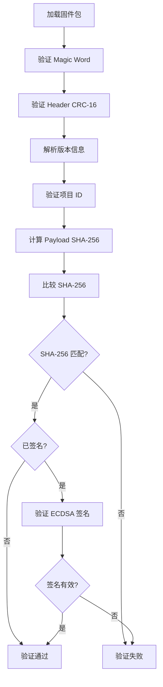
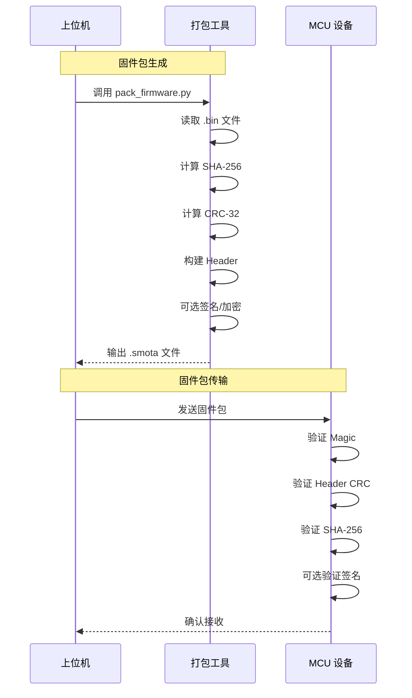

# SMOTA 固件包结构设计文档

## 1. 模块概述

### 1.1 功能描述

本模块定义 SMOTA 固件包的文件格式，包括 Header 结构、Payload 格式、签名验证机制，确保上位机能够生成正确格式的固件包，MCU 能够正确解析和验证固件。

### 1.2 设计目标

- **安全性**: 支持 SHA-256 校验和 ECDSA 签名验证
- **完整性**: 确保固件数据在传输和存储过程中不被篡改
- **可扩展性**: Header 预留保留字段用于未来扩展
- **兼容性**: 固件包格式向后兼容

### 1.3 依赖模块

- `smota_types.h` - 基础类型定义
- `smota_verify.h` - SHA-256 和签名验证
- `scripts/pack_firmware.py` - 固件打包工具

---

## 2. 架构设计

### 2.1 模块结构

```
smota_core/
├── inc/
│   └── smota_firmware.h    # 固件包结构定义
└── src/
    └── smota_firmware.c    # 固件包加载/验证实现

scripts/
└── pack_firmware.py        # 固件打包工具
```

### 2.2 固件包格式

```
+------------------+
|   Header (256B)  |  固定 256 Bytes
+------------------+
|   Payload        |  变长 (原始 .bin 固件数据)
+------------------+
```

---

## 3. API 接口

### 3.1 固件包加载接口

```c
/**
 * @brief  加载固件包
 * @param  path: 固件包文件路径
 * @param  header: 输出 Header 结构
 * @param  payload: 输出 Payload 数据指针 (需调用者释放)
 * @param  payload_size: 输出 Payload 大小
 * @return 0=成功, <0=失败
 */
int smota_firmware_load(const char *path,
                        struct smota_firmware_header *header,
                        uint8_t **payload,
                        uint32_t *payload_size);
```

### 3.2 固件包释放接口

```c
/**
 * @brief  释放固件包资源
 * @param  payload: Payload 数据指针
 */
void smota_firmware_free(uint8_t *payload);
```

### 3.3 固件包验证接口

```c
/**
 * @brief  验证固件包
 * @param  header: Header 结构
 * @param  payload: Payload 数据
 * @return 0=验证通过, <0=验证失败
 */
int smota_firmware_verify(const struct smota_firmware_header *header,
                          const uint8_t *payload);
```

### 3.4 Header 解析接口

```c
/**
 * @brief  从缓冲区解析 Header
 * @param  buffer: 包含 Header 的缓冲区
 * @param  header: 输出 Header 结构
 * @return 0=成功, <0=失败
 */
int smota_firmware_parse_header(const uint8_t *buffer,
                                 struct smota_firmware_header *header);
```

---

## 4. 数据结构

### 4.1 固件包 Header 结构

```c
#pragma pack(push, 1)

/**
 * @brief  smOTA 固件包 Header (256 Bytes)
 */
struct smota_firmware_header {
    /* ========== Magic Word (4 Bytes) ========== */
    uint8_t  magic[4];            /* 0xAA, 0x55, 0xAA, 0x55 */

    /* ========== 版本信息 (3 Bytes) ========== */
    uint8_t  version_major;       /* 主版本号 */
    uint8_t  version_minor;       /* 次版本号 */
    uint8_t  version_patch;       /* 补丁版本号 */

    /* ========== 固件信息 (8 Bytes) ========== */
    uint32_t firmware_size;       /* Payload 实际大小 (小端) */
    uint32_t firmware_crc;        /* Payload CRC-32 (小端) */

    /* ========== 安全信息 (32 Bytes) ========== */
    uint8_t  sha256_hash[32];     /* Payload SHA-256 摘要 */

    /* ========== 签名信息 (64 Bytes) - 可选 ========== */
    uint8_t  signature_r[32];     /* ECDSA 签名 r 分量 */
    uint8_t  signature_s[32];     /* ECDSA 签名 s 分量 */

    /* ========== 标志位 (4 Bytes) ========== */
    uint32_t flags;               /* bit0: 加密标志
                                   * bit1: 防回滚标志
                                   * bit2: 签名标志
                                   * bit3-31: 保留 */

    /* ========== 时间戳 (4 Bytes) ========== */
    uint32_t timestamp;           /* 构建时间戳 (Unix 时间, 小端) */

    /* ========== UUID (16 Bytes) ========== */
    uint8_t  uuid[16];            /* 唯一标识符 */

    /* ========== 硬件信息 (8 Bytes) ========== */
    uint32_t project_id;          /* 项目 ID (小端) */
    uint32_t hardware_ver;        /* 硬件版本 (小端) */

    /* ========== 保留字段 (113 Bytes) ========== */
    uint16_t header_crc;          /* Header CRC-16 (小端) */
    uint8_t  reserved[111];       /* 保留字段 */
};

#pragma pack(pop)

#define SMOTA_FIRMWARE_HEADER_SIZE  256
```

### 4.2 标志位定义

```c
/* 固件包标志位 */
#define SMOTA_FIRMWARE_FLAG_ENCRYPTED       0x01  /* bit0: 固件已加密 */
#define SMOTA_FIRMWARE_FLAG_ANTI_ROLLBACK   0x02  /* bit1: 启用防回滚 */
#define SMOTA_FIRMWARE_FLAG_SIGNED          0x04  /* bit2: 固件已签名 */
```

### 4.3 魔数定义

```c
/* 固件包 Magic Word */
#define SMOTA_FIRMWARE_MAGIC     {0xAA, 0x55, 0xAA, 0x55}
```

---

## 5. 固件包文件格式

### 5.1 文件扩展名

- 完整固件包: `.smota` 或 `.ota`
- 仅固件数据: `.bin`

### 5.2 文件结构示例

```
my_firmware_v1.0.1.smota
├── Header (256 Bytes)
│   ├── Magic: 0xAA55AA55
│   ├── Version: 1.0.1
│   ├── Size: 65536 Bytes
│   ├── SHA256: [32 bytes hash]
│   └── ...
└── Payload (65536 Bytes)
    └── [原始固件二进制数据]
```

---

## 6. 固件包生成工具

### 6.1 工具位置

`scripts/pack_firmware.py`

### 6.2 工具功能

1. 读取原始 .bin 固件文件
2. 计算 SHA-256 和 CRC-32
3. 添加 Header 信息
4. 可选签名和加密
5. 输出 .smota 文件

### 6.3 使用示例

```bash
# 基本打包
python scripts/pack_firmware.py input.bin output.smota \
    --version 1.0.1 \
    --project-id 0x12345678

# 带签名
python scripts/pack_firmware.py input.bin output.smota \
    --version 1.0.1 \
    --project-id 0x12345678 \
    --sign

# 带加密
python scripts/pack_firmware.py input.bin output.smota \
    --version 1.0.1 \
    --project-id 0x12345678 \
    --encrypt
```

---

## 7. 验证流程

### 7.1 验证步骤



### 7.2 验证顺序

1. **Magic Word 验证**: 确保是有效的固件包
2. **Header CRC-16 验证**: 确保 Header 完整性
3. **版本信息验证**: 检查版本号格式
4. **项目 ID 验证**: 确保固件匹配设备
5. **SHA-256 验证**: 确保 Payload 完整性
6. **签名验证** (可选): 确保固件来源可信

---

## 8. 实现要点

### 8.1 关键算法

1. **SHA-256 计算**: 使用 TinyCrypt 库
2. **CRC-32 计算**: 标准 CRC-32-IEEE 802.3
3. **ECDSA 签名**: 使用 P-256 曲线

### 8.2 注意事项

1. **字节序**: 所有多字节字段使用小端序
2. **对齐**: Header 结构使用 `#pragma pack(push, 1)`
3. **大小固定**: Header 固定 256 Bytes
4. **签名位置**: 签名字段在 Header 中，不是 Payload

### 8.3 安全考虑

1. **签名验证**: 强制要求签名验证（生产环境）
2. **防回滚**: 检查版本号不小于当前版本
3. **项目 ID 匹配**: 确保固件用于正确的项目

---

## 9. 测试要点

### 9.1 单元测试

- Header 解析测试
- SHA-256 计算测试
- CRC-32 计算测试
- 签名验证测试

### 9.2 集成测试

- 完整固件包加载测试
- 固件包验证测试
- 与上位机工具联调测试

### 9.3 边界测试

- 空固件测试
- 超大固件测试
- 错误格式处理测试
- 签名篡改检测测试

---

## 10. 文件清单

### 需要创建的文件

| 文件路径 | 说明 |
|:---------|:-----|
| `smota/smota_core/inc/smota_firmware.h` | 固件包结构定义 |
| `smota/smota_core/src/smota_firmware.c` | 固件包加载/验证实现 |
| `scripts/pack_firmware.py` | 固件打包工具 |

### 需要参考的文件

| 文件路径 | 用途 |
|:---------|:-----|
| `doc/0.requirements.md` | 固件包结构规范 |
| `scripts/keygen.py` | 密钥生成工具参考 |
| `examples/win_sim/keys/` | 测试用密钥 |

---

## 11. 时序图

### 11.1 固件包处理流程



---

**文档版本**: 1.0
**创建日期**: 2026-03-03
**作者**: Architect
**状态**: 待实现
