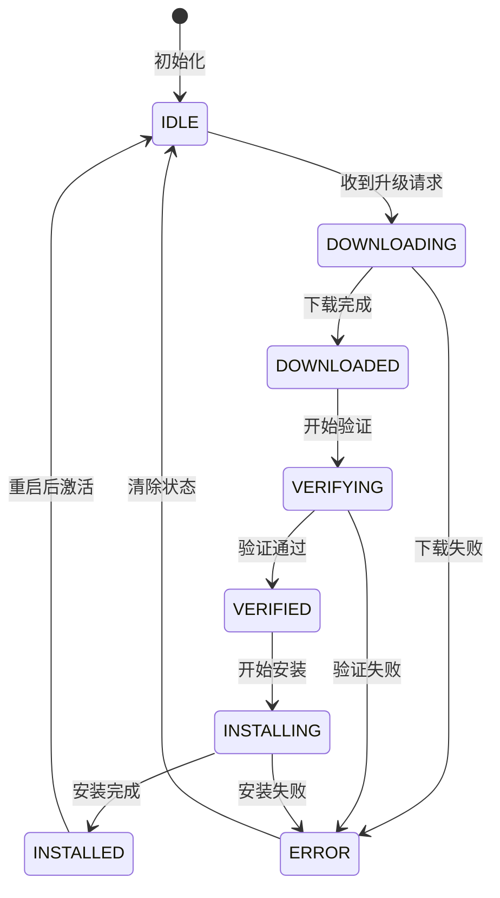
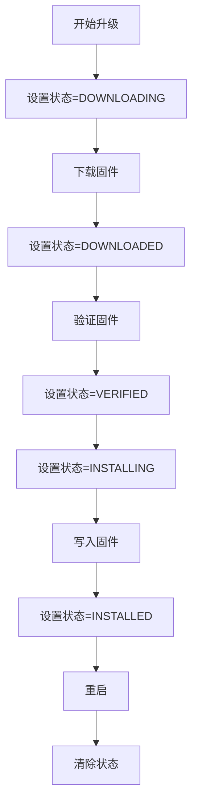
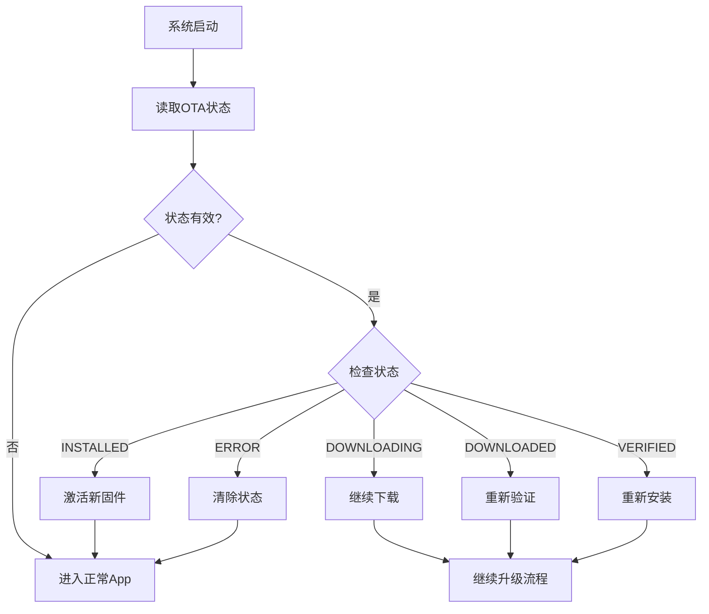
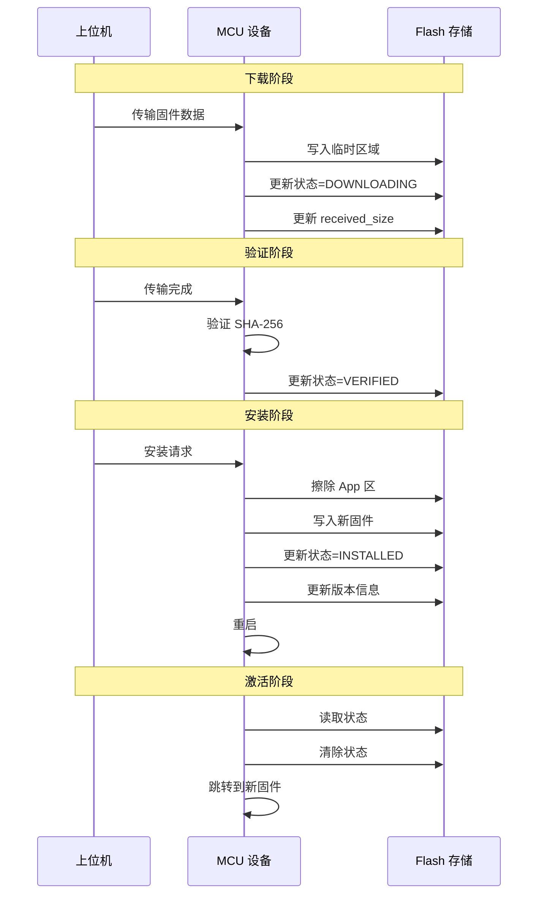

# SMOTA 单分区 Flash 布局设计文档

## 1. 模块概述

### 1.1 功能描述

本模块定义 SMOTA 单分区覆盖模式 (`SMOTA_MODE=2`) 下的 Flash 布局、状态标志存储和版本信息管理，实现断电保护和固件版本管理功能。

### 1.2 设计目标

- **断电保护**: 任何时刻断电，系统重启后都能恢复到一致状态
- **原子性**: 状态写入应具有原子性
- **可靠性**: 关键信息使用 CRC 校验
- **可扩展性**: 结构体预留扩展字段

### 1.3 依赖模块

- `smota_config.h` - Flash 配置参数
- `smota_flash.h` - Flash 操作接口
- `smota_port.c` - HAL Flash 驱动

---

## 2. 架构设计

### 2.1 模块结构

```
smota_core/
├── inc/
│   └── smota_storage.h      # 存储相关定义
└── src/
    └── smota_storage.c      # 存储操作实现
```

### 2.2 Flash 分区布局

```
+------------------------+ 0x08000000
|   Bootloader (16KB)    |  Bootloader 区
+------------------------+ 0x08004000
|                        |
|   App (256KB)          |  应用程序区
|                        |
+------------------------+ 0x08044000
|   OTA State (1KB)      |  状态标志区
+------------------------+ 0x08044400
|   Config (1KB)         |  配置区
+------------------------+ 0x08044800
|   Reserved (14KB)      |  保留区
+------------------------+ 0x08008000 (Flash 结束)
```

---

## 3. API 接口

### 3.1 OTA 状态管理接口

```c
/**
 * @brief  初始化 OTA 状态
 * @return 0=成功, <0=失败
 */
int smota_state_init(void);

/**
 * @brief  读取 OTA 状态
 * @param  state: 输出状态结构
 * @return 0=成功, <0=失败
 */
int smota_state_read(struct smota_ota_state *state);

/**
 * @brief  写入 OTA 状态
 * @param  state: 状态结构
 * @return 0=成功, <0=失败
 */
int smota_state_write(const struct smota_ota_state *state);

/**
 * @brief  清除 OTA 状态
 * @return 0=成功, <0=失败
 */
int smota_state_clear(void);

/**
 * @brief  验证 OTA 状态有效性
 * @param  state: 状态结构
 * @return 1=有效, 0=无效
 */
int smota_state_is_valid(const struct smota_ota_state *state);
```

### 3.2 版本信息管理接口

```c
/**
 * @brief  读取当前版本信息
 * @param  version: 输出版本结构
 * @return 0=成功, <0=失败
 */
int smota_version_read(struct smota_version_info *version);

/**
 * @brief  写入版本信息
 * @param  version: 版本结构
 * @return 0=成功, <0=失败
 */
int smota_version_write(const struct smota_version_info *version);

/**
 * @brief  版本比较
 * @param  v1: 版本 1
 * @param  v2: 版本 2
 * @return 1=v1>v2, 0=v1=v2, -1=v1<v2
 */
int smota_version_compare(const struct smota_version_info *v1,
                          const struct smota_version_info *v2);

/**
 * @brief  检查版本回滚
 * @param  current: 当前版本
 * @param  new: 新版本
 * @return 0=允许更新, -1=拒绝回滚
 */
int smota_version_check_rollback(const struct smota_version_info *current,
                                  const struct smota_version_info *new);
```

---

## 4. 数据结构

### 4.1 地址定义

```c
/* Flash 基地址 */
#define SMOTA_FLASH_BASE            0x08000000

/* Bootloader 区 */
#define SMOTA_BOOTLOADER_OFFSET     0x00000000
#define SMOTA_BOOTLOADER_ADDR       (SMOTA_FLASH_BASE + SMOTA_BOOTLOADER_OFFSET)
#define SMOTA_BOOTLOADER_SIZE       0x00004000  /* 16KB */

/* App 区 */
#define SMOTA_APP_OFFSET            0x00004000
#define SMOTA_APP_ADDR              (SMOTA_FLASH_BASE + SMOTA_APP_OFFSET)
#define SMOTA_APP_SIZE              0x00040000  /* 256KB */

/* OTA 状态区 */
#define SMOTA_STATE_OFFSET          0x00044000
#define SMOTA_STATE_ADDR            (SMOTA_FLASH_BASE + SMOTA_STATE_OFFSET)
#define SMOTA_STATE_SIZE            0x00000400  /* 1KB */

/* 配置区 */
#define SMOTA_CONFIG_OFFSET         0x00044400
#define SMOTA_CONFIG_ADDR           (SMOTA_FLASH_BASE + SMOTA_CONFIG_OFFSET)
#define SMOTA_CONFIG_SIZE           0x00000400  /* 1KB */
```

### 4.2 OTA 状态标志结构

```c
#pragma pack(push, 1)

/**
 * @brief  OTA 状态标志
 * @details 存储在 Flash 的 OTA 状态区，用于断电保护
 */
struct smota_ota_state {
    uint8_t  magic[4];            /* 魔数: 'O', 'T', 'A', 'S' */
    uint8_t  state;               /* 当前状态 */
    uint8_t  flags;               /* 标志位 */
    uint16_t crc;                 /* CRC-16 校验 */
    uint32_t firmware_size;       /* 新固件大小 */
    uint32_t received_size;       /* 已接收大小 */
    uint8_t  new_version[3];      /* 新固件版本 */
    uint8_t  current_version[3];  /* 当前固件版本 */
    uint32_t timestamp;           /* 时间戳 */
    uint8_t  reserved[16];        /* 保留字段 */
};

#pragma pack(pop)

/* OTA 状态魔数 */
#define SMOTA_OTA_STATE_MAGIC     {'O', 'T', 'A', 'S'}

/* 状态值定义 */
#define SMOTA_OTA_STATE_IDLE            0x00
#define SMOTA_OTA_STATE_DOWNLOADING     0x01
#define SMOTA_OTA_STATE_DOWNLOADED      0x02
#define SMOTA_OTA_STATE_VERIFYING       0x03
#define SMOTA_OTA_STATE_VERIFIED        0x04
#define SMOTA_OTA_STATE_INSTALLING      0x05
#define SMOTA_OTA_STATE_INSTALLED       0x06
#define SMOTA_OTA_STATE_ERROR           0xFF

/* 标志位定义 */
#define SMOTA_OTA_FLAG_VALID            0x01  /* 状态有效 */
#define SMOTA_OTA_FLAG_NEED_REBOOT      0x02  /* 需要重启 */
#define SMOTA_OTA_FLAG_UPDATE_SUCCESS   0x04  /* 更新成功 */
```

### 4.3 版本信息结构

```c
#pragma pack(push, 1)

/**
 * @brief  固件版本信息
 * @details 存储在 Flash 的配置区
 */
struct smota_version_info {
    uint8_t  magic[4];            /* 魔数: 'V', 'E', 'R', 'S' */
    uint8_t  major;               /* 主版本号 */
    uint8_t  minor;               /* 次版本号 */
    uint8_t  patch;               /* 补丁版本号 */
    uint8_t  flags;               /* 标志位 */
    uint16_t crc;                 /* CRC-16 校验 */
    uint32_t build_time;          /* 构建时间戳 */
    uint32_t firmware_size;       /* 固件大小 */
    uint8_t  sha256_hash[32];     /* 固件 SHA-256 */
    uint8_t  reserved[16];        /* 保留字段 */
};

#pragma pack(pop)

/* 版本信息魔数 */
#define SMOTA_VERSION_MAGIC       {'V', 'E', 'R', 'S'}

/* 版本标志位 */
#define SMOTA_VERSION_FLAG_VALID  0x01  /* 版本信息有效 */
```

---

## 5. 状态机设计

### 5.1 状态转换图



### 5.2 状态与协议状态映射

| OTA 状态 | 协议状态 | 说明 |
|:---------|:---------|:-----|
| IDLE | SMOTA_STATE_IDLE | 空闲状态 |
| DOWNLOADING | SMOTA_STATE_TRANSFER | 数据传输中 |
| DOWNLOADED | SMOTA_STATE_COMPLETE | 传输完成 |
| VERIFYING | SMOTA_STATE_COMPLETE | 验证中 |
| VERIFIED | SMOTA_STATE_INSTALL | 准备安装 |
| INSTALLING | SMOTA_STATE_INSTALL | 安装中 |
| INSTALLED | SMOTA_STATE_ACTIVATE | 等待激活 |
| ERROR | SMOTA_STATE_ERROR | 错误状态 |

---

## 6. 断电保护流程

### 6.1 正常升级流程



### 6.2 断电恢复流程



### 6.3 恢复策略

| 断电时状态 | 恢复动作 |
|:-----------|:---------|
| DOWNLOADING | 继续下载（支持断点续传）|
| DOWNLOADED | 重新验证固件 |
| VERIFIED | 重新安装固件 |
| INSTALLING | 重新安装固件 |
| INSTALLED | 激活新固件 |
| ERROR | 清除状态，保持旧固件 |

---

## 7. 实现要点

### 7.1 原子性保证

1. **双备份策略**: 关键状态写入两个备份区域
2. **CRC 校验**: 读取时验证 CRC，损坏时使用备份
3. **写入顺序**: 先写新数据，再更新标志

### 7.2 Flash 磨损均衡

1. **状态区循环写入**: 使用多个状态槽位循环
2. **最小化写入次数**: 只在状态变化时写入
3. **保留字段预留**: 支持未来添加更多状态槽位

### 7.3 安全考虑

1. **魔数验证**: 防止读取错误数据
2. **CRC 校验**: 检测数据损坏
3. **版本回滚检查**: 防止降级攻击

---

## 8. 测试要点

### 8.1 单元测试

- 状态读写测试
- 版本比较测试
- CRC 校验测试
- 魔数验证测试

### 8.2 集成测试

- 完整升级流程测试
- 断电恢复测试
- 状态转换测试

### 8.3 边界测试

- Flash 擦除次数测试
- 状态损坏恢复测试
- 最大固件大小测试

---

## 9. 文件清单

### 需要创建的文件

| 文件路径 | 说明 |
|:---------|:-----|
| `smota/smota_core/inc/smota_storage.h` | 存储相关定义 |
| `smota/smota_core/src/smota_storage.c` | 存储操作实现 |

### 需要修改的文件

| 文件路径 | 修改内容 |
|:---------|:---------|
| `smota/smota_core/inc/smota_config.h` | 添加地址定义 |

### 需要参考的文件

| 文件路径 | 用途 |
|:---------|:-----|
| `doc/0.requirements.md` | 单分区模式规范 |
| `examples/win_sim/port/smota_port.c` | Flash Mock 实现 |

---

## 10. 时序图

### 10.1 完整升级流程



---

**文档版本**: 1.0
**创建日期**: 2026-03-03
**作者**: Architect
**状态**: 待实现
