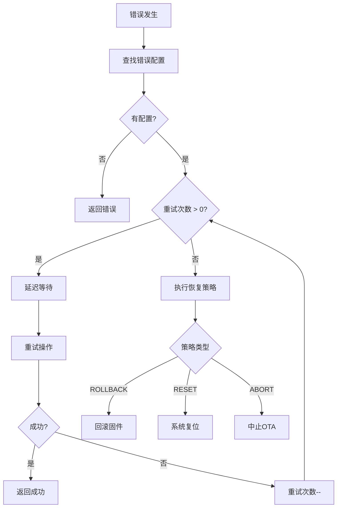
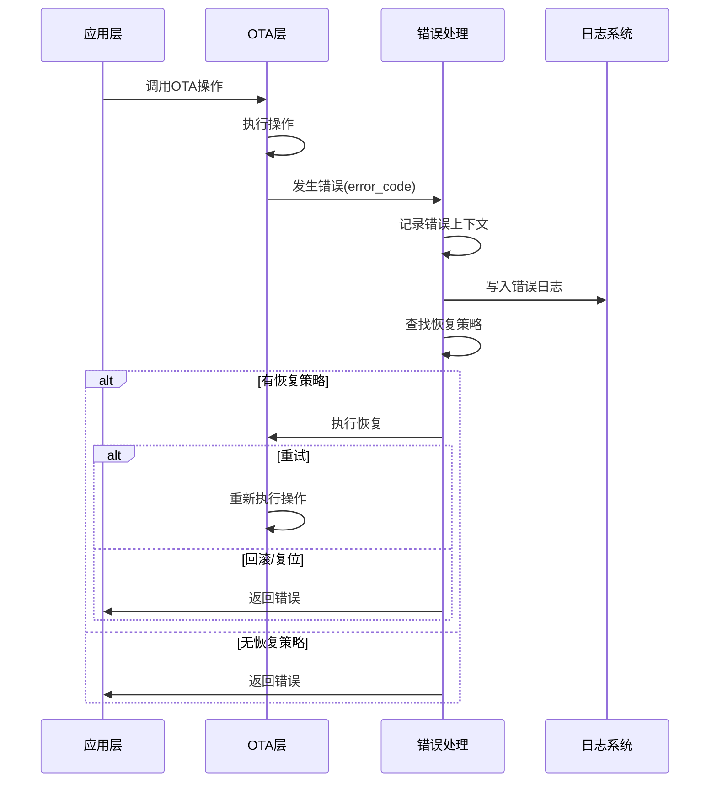

# SMOTA 错误处理机制设计文档

## 1. 模块概述

### 1.1 功能描述

本模块定义 SMOTA 的完整错误处理和恢复机制，包括错误码定义、错误日志、错误恢复策略和调试输出接口，确保系统能够正确报告错误、记录日志、并提供恢复能力。

### 1.2 设计目标

- **层次化**: 错误处理分层次，底层错误向上传递
- **可追踪**: 所有错误都记录日志，包含上下文信息
- **可恢复**: 部分错误可自动恢复或重试
- **低开销**: 日志系统在 Release 模式下可完全移除

### 1.3 依赖模块

- `smota_types.h` - 基础类型定义
- `smota_config.h` - 调试配置
- `smota_port.c` - 日志输出接口

---

## 2. 架构设计

### 2.1 模块结构

```
smota_core/
├── inc/
│   ├── smota_types.h       # 更新错误相关定义
│   └── smota_log.h         # 日志系统定义
└── src/
    ├── smota_types.c       # 实现错误处理函数
    └── smota_log.c         # 日志系统实现
```

### 2.2 错误处理层次

```
┌─────────────────────────────────────┐
│        应用层 (Application)          │  ← 用户可见错误
├─────────────────────────────────────┤
│        OTA 层 (smota_core)           │  ← 协议错误
├─────────────────────────────────────┤
│        存储层 (smota_storage)        │  ← Flash 错误
├─────────────────────────────────────┤
│        驱动层 (HAL)                  │  ← 硬件错误
└─────────────────────────────────────┘
```

---

## 3. API 接口

### 3.1 错误处理接口

```c
/**
 * @brief  处理错误
 * @param  error: 错误码
 * @return 处理后的错误码
 */
smota_err_t smota_error_handle(smota_err_t error);

/**
 * @brief  设置错误恢复策略
 * @param  config: 配置数组
 * @param  count: 配置数量
 * @return 0=成功, <0=失败
 */
int smota_error_set_recovery(const struct smota_error_config *config,
                              uint16_t count);

/**
 * @brief  获取错误上下文
 * @param  ctx: 输出错误上下文
 * @return 0=成功, <0=失败
 */
int smota_error_get_context(struct smota_error_context *ctx);
```

### 3.2 错误信息接口

```c
/**
 * @brief  获取错误码对应的字符串
 * @param  error: 错误码
 * @return 错误描述字符串
 */
const char *smota_err_to_string(smota_err_t error);

/**
 * @brief  获取状态对应的字符串
 * @param  state: 状态
 * @return 状态描述字符串
 */
const char *smota_state_to_string(smota_state_t state);

/**
 * @brief  获取详细的错误描述
 * @param  error: 错误码
 * @param  buffer: 输出缓冲区
 * @param  size: 缓冲区大小
 * @return 实际写入字节数
 */
int smota_err_get_detail(smota_err_t error, char *buffer, uint16_t size);
```

### 3.3 错误日志接口

```c
/**
 * @brief  初始化错误日志系统
 * @param  buffer: 日志缓冲区
 * @param  size: 缓冲区大小（条目数）
 * @return 0=成功, <0=失败
 */
int smota_log_init(struct smota_error_log *buffer, uint16_t size);

/**
 * @brief  记录错误
 * @param  error_code: 错误码
 * @param  data: 附加数据
 * @return 0=成功, <0=失败
 */
int smota_log_error(smota_err_t error_code, uint16_t data);

/**
 * @brief  获取错误日志
 * @param  index: 日志索引
 * @param  log: 输出日志条目
 * @return 0=成功, <0=失败
 */
int smota_log_get(uint16_t index, struct smota_error_log *log);

/**
 * @brief  清除错误日志
 * @return 0=成功, <0=失败
 */
int smota_log_clear(void);
```

### 3.4 调试输出接口

```c
/**
 * @brief  设置日志级别
 * @param  level: 日志级别
 */
void smota_log_set_level(smota_log_level_t level);

/**
 * @brief  获取日志级别
 * @return 当前日志级别
 */
smota_log_level_t smota_log_get_level(void);

/**
 * @brief  设置日志输出函数
 * @param  output: 输出函数指针
 */
void smota_log_set_output(smota_log_output_fn output);

/**
 * @brief  日志输出函数
 * @param  level: 日志级别
 * @param  file: 文件名
 * @param  line: 行号
 * @param  fmt: 格式化字符串
 */
void smota_log_output(smota_log_level_t level,
                      const char *file,
                      int line,
                      const char *fmt, ...);
```

---

## 4. 数据结构

### 4.1 错误码枚举

```c
/**
 * @brief  OTA 错误码
 */
typedef enum {
    /* 成功 (0) */
    SMOTA_ERR_OK                        = 0,

    /* 通用错误 (1-10) */
    SMOTA_ERR_INVALID_STATE             = 1,    /* 无效状态 */
    SMOTA_ERR_INVALID_PARAM             = 2,    /* 无效参数 */
    SMOTA_ERR_NOT_SUPPORTED             = 3,    /* 功能不支持 */
    SMOTA_ERR_BUSY                      = 4,    /* 设备忙 */
    SMOTA_ERR_NO_MEMORY                 = 5,    /* 内存不足 */

    /* 通信错误 (11-20) */
    SMOTA_ERR_TIMEOUT                   = 11,   /* 操作超时 */
    SMOTA_ERR_COMM_FAILED               = 12,   /* 通信失败 */
    SMOTA_ERR_PACKET_INVALID            = 13,   /* 无效数据包 */
    SMOTA_ERR_CRC_FAILED                = 14,   /* CRC 校验失败 */

    /* 版本错误 (21-30) */
    SMOTA_ERR_VERSION                   = 21,   /* 版本错误 */
    SMOTA_ERR_VERSION_ROLLBACK          = 22,   /* 版本回滚 */
    SMOTA_ERR_VERSION_MISMATCH          = 23,   /* 版本不匹配 */

    /* Flash 错误 (31-40) */
    SMOTA_ERR_FLASH                     = 31,   /* Flash 操作失败 */
    SMOTA_ERR_FLASH_WRITE               = 32,   /* Flash 写入失败 */
    SMOTA_ERR_FLASH_ERASE               = 33,   /* Flash 擦除失败 */
    SMOTA_ERR_FLASH_READ                = 34,   /* Flash 读取失败 */
    SMOTA_ERR_FLASH_INSUFFICIENT        = 35,   /* Flash 空间不足 */
    SMOTA_ERR_FLASH_LOCKED              = 36,   /* Flash 已锁定 */

    /* 验证错误 (41-50) */
    SMOTA_ERR_VERIFY                    = 41,   /* 验证失败 */
    SMOTA_ERR_VERIFY_SHA256_FAILED      = 42,   /* SHA-256 验证失败 */
    SMOTA_ERR_VERIFY_CRC32_FAILED       = 43,   /* CRC-32 验证失败 */
    SMOTA_ERR_VERIFY_HEADER_FAILED      = 44,   /* Header 验证失败 */

    /* 安全错误 (51-60) */
    SMOTA_ERR_SIGNATURE                 = 51,   /* 签名验证失败 */
    SMOTA_ERR_DECRYPT                   = 52,   /* 解密失败 */
    SMOTA_ERR_KEY_INVALID               = 53,   /* 密钥无效 */

    /* 系统错误 (61-70) */
    SMOTA_ERR_SYSTEM                    = 61,   /* 系统错误 */
    SMOTA_ERR_HARDWARE                  = 62,   /* 硬件错误 */
    SMOTA_ERR_WATCHDOG                  = 63,   /* 看门狗超时 */
    SMOTA_ERR_POWER                     = 64,   /* 电源异常 */

    /* 未知错误 */
    SMOTA_ERR_UNKNOWN                   = 255,

} smota_err_t;
```

### 4.2 错误上下文结构

```c
/**
 * @brief  错误上下文
 * @details 记录错误发生时的详细信息
 */
struct smota_error_context {
    smota_err_t    error_code;       /* 错误码 */
    smota_state_t  state;            /* 发生错误时的状态 */
    uint32_t       timestamp;        /* 错误发生时间戳 */
    uint16_t       line;             /* 发生错误的代码行号 */
    const char    *file;             /* 发生错误的文件名 */
    const char    *function;         /* 发生错误的函数名 */
    char           message[64];      /* 错误描述信息 */
    uint8_t        reserved[32];     /* 保留字段 */
};
```

### 4.3 错误日志结构

```c
/**
 * @brief  错误日志条目
 */
struct smota_error_log {
    uint32_t    timestamp;           /* 时间戳 */
    smota_err_t error_code;          /* 错误码 */
    uint8_t     state;               /* 当时状态 */
    uint16_t    data;                /* 附加数据 */
    uint8_t     reserved[8];         /* 保留字段 */
};
```

### 4.4 错误恢复配置

```c
/**
 * @brief  错误恢复策略
 */
typedef enum {
    SMOTA_RECOVER_NONE,              /* 不自动恢复 */
    SMOTA_RECOVER_RETRY,             /* 重试 */
    SMOTA_RECOVER_ROLLBACK,          /* 回滚 */
    SMOTA_RECOVER_RESET,             /* 复位 */
    SMOTA_RECOVER_ABORT,             /* 中止 */
} smota_recovery_t;

/**
 * @brief  错误处理配置
 */
struct smota_error_config {
    smota_err_t      error_code;     /* 错误码 */
    smota_recovery_t recovery;       /* 恢复策略 */
    uint8_t         max_retry;       /* 最大重试次数 */
    uint16_t        retry_delay_ms;  /* 重试延迟 */
};
```

### 4.5 日志级别定义

```c
/**
 * @brief  日志级别
 */
typedef enum {
    SMOTA_LOG_LEVEL_NONE = 0,        /* 关闭 */
    SMOTA_LOG_LEVEL_ERROR,           /* 错误 */
    SMOTA_LOG_LEVEL_WARN,            /* 警告 */
    SMOTA_LOG_LEVEL_INFO,            /* 信息 */
    SMOTA_LOG_LEVEL_DEBUG,           /* 调试 */
    SMOTA_LOG_LEVEL_VERBOSE,         /* 详细 */
} smota_log_level_t;

/**
 * @brief  日志输出函数类型
 */
typedef void (*smota_log_output_fn)(const char *message);
```

---

## 5. 调试输出宏

### 5.1 日志输出宏

```c
/**
 * @brief  调试输出宏
 */
#define SMOTA_LOGE(fmt, ...)    \
    smota_log_output(SMOTA_LOG_LEVEL_ERROR, __FILE__, __LINE__, fmt, ##__VA_ARGS__)

#define SMOTA_LOGW(fmt, ...)    \
    smota_log_output(SMOTA_LOG_LEVEL_WARN, __FILE__, __LINE__, fmt, ##__VA_ARGS__)

#define SMOTA_LOGI(fmt, ...)    \
    smota_log_output(SMOTA_LOG_LEVEL_INFO, __FILE__, __LINE__, fmt, ##__VA_ARGS__)

#define SMOTA_LOGD(fmt, ...)    \
    smota_log_output(SMOTA_LOG_LEVEL_DEBUG, __FILE__, __LINE__, fmt, ##__VA_ARGS__)

#define SMOTA_LOGV(fmt, ...)    \
    smota_log_output(SMOTA_LOG_LEVEL_VERBOSE, __FILE__, __LINE__, fmt, ##__VA_ARGS__)
```

### 5.2 断言宏

```c
/**
 * @brief  断言宏（仅在调试模式生效）
 */
#if SMOTA_ENABLE_DEBUG
    #define SMOTA_ASSERT(expr) \
        do { \
            if (!(expr)) { \
                SMOTA_LOGE("Assert failed: %s at %s:%d", #expr, __FILE__, __LINE__); \
                smota_error_handle(SMOTA_ERR_UNKNOWN); \
            } \
        } while(0)

    #define SMOTA_ASSERT_ERROR(expr, error) \
        do { \
            if (!(expr)) { \
                SMOTA_LOGE("Assert failed: %s (code=%d) at %s:%d", \
                           #expr, error, __FILE__, __LINE__); \
                smota_error_handle(error); \
            } \
        } while(0)
#else
    #define SMOTA_ASSERT(expr) ((void)0)
    #define SMOTA_ASSERT_ERROR(expr, error) ((void)0)
#endif
```

---

## 6. 错误恢复策略

### 6.1 恢复策略表

| 错误码 | 恢复策略 | 最大重试 | 重试延迟 |
|:-------|:---------|:---------|:---------|
| TIMEOUT | RETRY | 3 | 1000ms |
| COMM_FAILED | RETRY | 3 | 1000ms |
| CRC_FAILED | RETRY | 2 | 500ms |
| FLASH_WRITE | RESET | 0 | 0 |
| VERSION_ROLLBACK | ABORT | 0 | 0 |
| SIGNATURE | ABORT | 0 | 0 |

### 6.2 恢复流程



---

## 7. 实现要点

### 7.1 关键设计

1. **线程安全**: 错误日志使用环形缓冲区，支持多线程访问
2. **低开销**: 日志系统在 Release 模式下可完全编译掉
3. **上下文保留**: 错误发生时保留完整上下文便于调试

### 7.2 注意事项

1. **递归保护**: 错误处理函数内部不能再触发错误处理
2. **内存限制**: 日志缓冲区大小可配置，避免占用过多内存
3. **时间戳**: 需要提供获取系统时间的接口

### 7.3 性能考虑

1. **条件编译**: 调试输出使用条件编译
2. **字符串表**: 错误字符串表存储在 Flash 而非 RAM
3. **快速路径**: 常见错误码使用快速判断路径

---

## 8. 测试要点

### 8.1 单元测试

- 错误码字符串映射测试
- 错误日志读写测试
- 恢复策略测试
- 日志级别测试

### 8.2 集成测试

- 完整错误流程测试
- 断言触发测试
- 日志输出测试

### 8.3 边界测试

- 日志缓冲区满测试
- 最大重试次数测试
- 错误嵌套测试

---

## 9. 文件清单

### 需要修改的文件

| 文件路径 | 修改内容 |
|:---------|:---------|
| `smota/smota_core/inc/smota_types.h` | 更新错误码定义 |
| `smota/smota_core/src/smota_types.c` | 实现错误处理函数 |

### 需要创建的文件

| 文件路径 | 说明 |
|:---------|:-----|
| `smota/smota_core/inc/smota_log.h` | 日志系统定义 |
| `smota/smota_core/src/smota_log.c` | 日志系统实现 |

---

## 10. 时序图

### 10.1 错误处理流程



---

**文档版本**: 1.0
**创建日期**: 2026-03-03
**作者**: Architect
**状态**: 待实现
