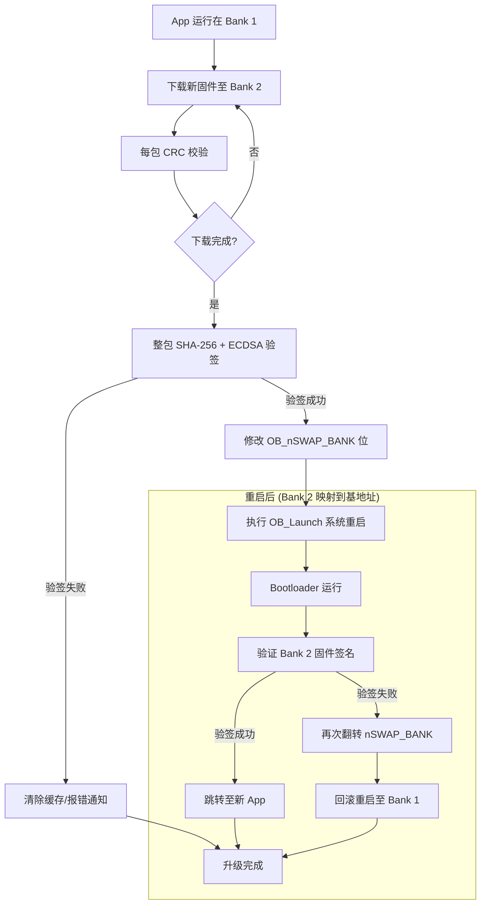
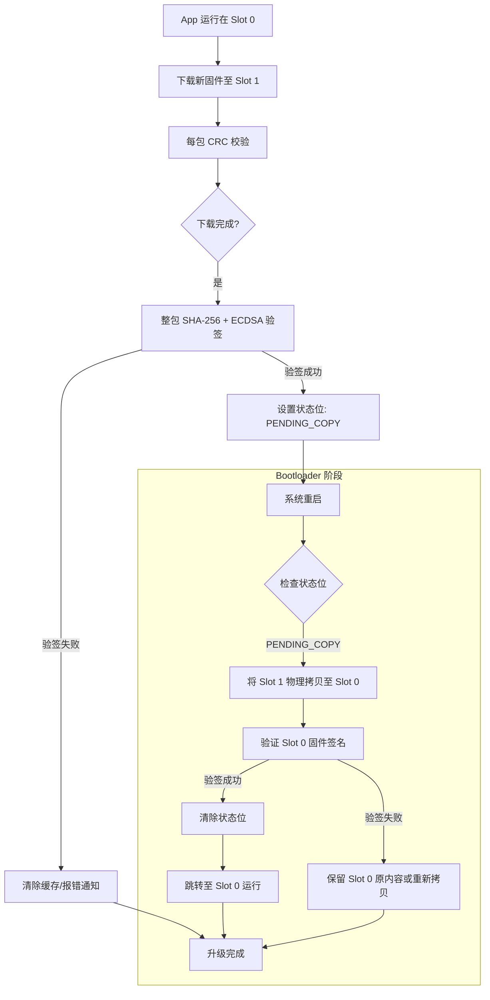
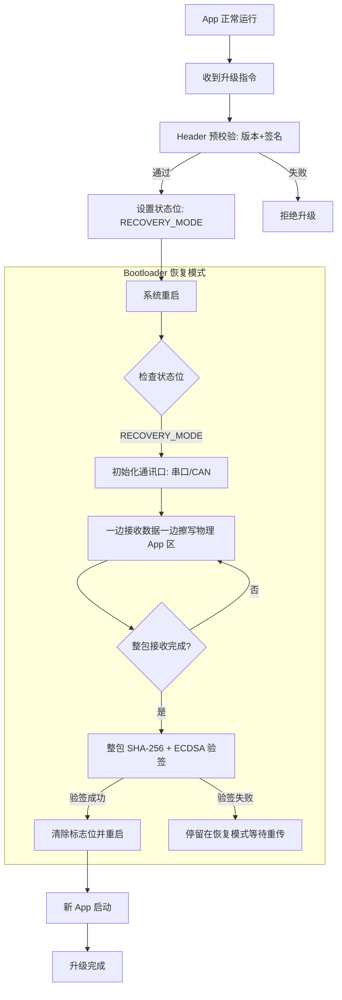

# 通用 MCU 安全升级库 - 详细需求规格书

> **项目名称**：Universal Secure OTA Library (smOTA)
> **目标平台**：通用 MCU 平台（支持 Cortex-M、RISC-V 等架构）
> **文档版本**：v1.1
> **编写日期**：2026-01-24

---

## 目录

1. [项目概述](#1-项目概述)
2. [硬件环境参考](#2-硬件环境参考)
3. [核心升级策略](#3-核心升级策略)
4. [五大可靠性设计维度](#4-五大可靠性设计维度)
5. [固件包结构定义](#5-固件包结构定义)
6. [状态机设计](#6-状态机设计)
7. [软件架构设计](#7-软件架构设计)
8. [安全方案](#8-安全方案)
9. [三种升级模式详细设计](#9-三种升级模式详细设计)
10. [API 接口规范](#10-api-接口规范)
11. [上位机/服务器要求](#11-上位机服务器要求)
12. [开发者注意事项](#12-开发者注意事项)

---

## 1. 项目概述

### 1.1 目标

开发一套轻量级、高度可靠且安全的 MCU 固件升级库，具备以下核心特性：

- **跨平台特性**：适配 STM32、RISC-V 等多种 MCU 架构
- **硬件抽象**：通过 HAL 接口层隔离硬件差异
- **高可靠性**：支持断电保护、固件回滚、多重校验
- **高安全性**：基于 ECDSA-P256 的固件签名验证

### 1.2 应用场景

- 物联网设备远程固件升级
- 工业控制设备固件维护
- 汽车电子 ECU 升级
- 消费电子产品 OTA 更新

---

## 2. 硬件环境参考

### 2.1 通用要求

| 参数 | 说明 |
|:-----|:-----|
| **架构支持** | ARM Cortex-M、RISC-V 等通用 MCU 架构 |
| **Flash 容量** | 建议 ≥ 128KB（取决于应用大小和升级模式） |
| **RAM 容量** | 建议 ≥ 8KB（用于加解密和 Hash 计算缓冲区） |
| **Flash 结构** | 支持单分区或双分区（双 Bank 或双 Slot） |

### 2.2 内存布局示意

```
Flash 地址空间 (通用布局):
+------------------------+ 0x08000000 (或 MCU Flash 基地址)
|   Bootloader (8-16KB)  |
+------------------------+ (地址根据 Bootloader 大小调整)
|                        |
|   Bank 1 / Slot 0      |
|   (Primary App)        |
|                        |
+------------------------+ (地址根据 Flash 大小调整)
|                        |
|   Bank 2 / Slot 1      |
|   (Secondary App)      |
|   (可选，双分区模式)    |
|                        |
+------------------------+
```

**注**：具体地址配置需根据目标 MCU 的 Flash 大小和 Bootloader 占用空间进行调整。

---

## 3. 核心升级策略

库需适配以下三种物理布局：

| 模式 | 描述 | 安全等级 | 空间占用 | 适用场景 |
|:-----|:-----|:---------|:---------|:---------|
| **双 Bank 交换 (Dual-Bank)** | 利用硬件映射交换 Bank 1/2 | 极高 (支持回滚) | 50% App 空间 | 支持硬件交换的 MCU (如 G0, L4) |
| **双槽位搬运 (Dual-Slot)** | 软件 Slot 0/1，由 Bootloader 物理搬运 | 高 (支持回滚) | 50% App 空间 | 通用 Cortex-M 芯片 |
| **单分区覆盖 (In-place)** | 直接覆盖当前 App，无备份区 | 中 (不支持回滚) | ~90% App 空间 | Flash 极度受限设备 |

### 3.1 三种模式对比

| 维度 | 双 Bank 硬件交换 | 双槽位软件搬运 | 单槽位覆盖安装 |
|:-----|:-----------------|:---------------|:---------------|
| **Bootloader 职责** | 仅验证与确认映射 | 验证、**物理拷贝数据** | **实现通讯协议+擦写** |
| **断电安全性** | 极高（硬件保证） | 高（依赖拷贝原子性） | 低（写入中断会导致砖头） |
| **回滚能力** | 毫秒级回滚 | 需重新搬运回滚 | **无回滚能力** |
| **Flash 占用** | 50% 冗余 | 50% 冗余 | **0% 冗余** |
| **App 链接地址** | 0x08000000 (固定) | 0x08002000 (偏移) | 0x08002000 (偏移) |

---

## 4. 五大可靠性设计维度

### 4.1 运行可靠性 (Operational Reliability) 【必须】

**目标**：确保升级过程在异常情况下系统能够恢复或回滚。

**实现要求**：

| 场景 | 处理策略 |
|:-----|:---------|
| 正常升级完成 | 标记新固件为激活状态，跳转执行 |
| 升级中断（断电/网络故障） | 系统重启后自动回滚到旧版本 |
| 验签失败 | 拒绝升级，保留当前版本 |

**注**：本库作为独立的 Bootloader 实现，不侵入 App 代码，因此不实现新固件运行时的异常检测（如看门狗触发的回滚）。App 层的运行状态监控由应用层自行实现。

### 4.2 来源可靠性 (Source Reliability) 【可选】

**目标**：确保固件由唯一合法的私钥持有者签发。

**技术方案**：

- **非对称加密算法**：ECDSA-P256 (secp256r1)
- **验签流程**：
  1. 服务器端使用私钥对固件摘要（SHA-256）进行签名
  2. MCU 库内置**硬编码公钥**（`const uint8_t` 数组，配合 WRP 保护）
  3. Bootloader 在跳转 App 前，必须通过公钥验证签名的合法性

### 4.3 内容可靠性 (Content Reliability) 【必须】

**目标**：确保固件在传输与存储过程中未发生 1-bit 的逻辑错误。

**双重校验体系**：

```
传输层 (Packet Level)               应用层 (Image Level)
┌─────────────┐                    ┌─────────────┐
│ 每包数据    │                    │ 固件整体    │
│ + CRC-16    │                    │ SHA-256     │
└─────────────┘                    └─────────────┘
      ↓                                    ↓
接收端实时校验                      全量数据校验
      ↓                                    ↓
  失败立即重传                     比对 Header 中的 Hash
                                 ↓
                           确保 Flash 数据与原始一致
```

### 4.4 过程可靠性 (Transmission Reliability) 【可选】

**目标**：防止固件被黑客通过总线监听（UART/CAN/SPI）进行逆向工程。

**技术方案**：

- **端到端加密**：AES-128-CBC 或 AES-128-CTR
- **加解密策略**：
  - 固件包在服务器侧整体加密
  - MCU 接收到密文后，在 RAM 中进行分块解密
  - 解密后的明文立即写入 Flash
- **一机一密（建议）**：利用 MCU 的唯一 ID (UID) 与主密钥派生出设备专属 AES 密钥

### 4.5 版本可靠性 (Version Reliability) 【可选】

**目标**：防止黑客通过重放（Replay）带有已知漏洞的旧版合法固件来攻击系统。

**防回滚机制 (Anti-Rollback)**：

```c
typedef struct {
    uint8_t major;
    uint8_t minor;
    uint8_t patch;
} FirmwareVersion_t;

// 版本比较逻辑
if (!(new_version > current_version || emergency_force_upgrade)) {
    return ERROR_VERSION_ROLLBACK;
}
```

---

## 5. 固件包结构定义

### 5.1 整体格式

```
+------------------+
|   Header         |  固定 128-256 Bytes
+------------------+
|   Payload        |  原始 .bin 固件数据
|   (可加密)       |
+------------------+
```

### 5.2 Header 结构定义

```c
#pragma pack(push, 1)

typedef struct {
    // Magic Word (4 Bytes): 0xAA, 0x55, 0xAA, 0x55
    uint8_t  magic[4];

    // 版本信息 (3 Bytes)
    uint8_t  version_major;
    uint8_t  version_minor;
    uint8_t  version_patch;

    // 固件信息
    uint32_t firmware_size;        // Payload 实际大小
    uint32_t firmware_crc;         // CRC-32 校验（可选）

    // 安全信息
    uint8_t  sha256_hash[32];      // 固件 SHA-256 摘要

    // ECDSA 签名 (64 Bytes)
    uint8_t  signature_r[32];
    uint8_t  signature_s[32];

    // 标志位
    uint16_t flags;                // bit0: 是否加密, bit1: 是否启用防回滚
    uint16_t header_crc;           // Header 自身的 CRC-16

    // 保留字段（填充至 256 Bytes）
    uint8_t  reserved[144];

} OTA_PackageHeader_t;

#pragma pack(pop)
```

---

## 6. 状态机设计

### 6.1 核心状态定义

```c
typedef enum {
    OTA_STATE_IDLE,           // 正常运行
    OTA_STATE_DOWNLOADING,    // 分包接收中
    OTA_STATE_VERIFYING,      // 验签中
    OTA_STATE_ACTIVATING,     // 激活中
    OTA_STATE_ERROR           // 错误状态
} OTA_State_t;
```

### 6.2 状态转换图

```
                    ┌─────────────┐
                    │    IDLE     │ ◄─────────────┐
                    └──────┬──────┘               │
                           │                      │
              收到升级指令 │                      │ 升级失败
                           ▼                      │
                    ┌─────────────┐               │
            ┌──────▶│ DOWNLOADING │───────┐       │
            │       └──────┬──────┘       │       │
            │              │ 下载完成     │       │
            │              ▼              │       │
            │       ┌─────────────┐       │       │
            │       │  VERIFYING  │◄──────┘       │
            │       └──────┬──────┘  验签失败     │
            │              │ 验签成功              │
            │              ▼                      │
            │       ┌─────────────┐               │
            └───────│ ACTIVATING  │───────────────┤
                    └──────┬──────┘               │
                           │ 重启并跳转           │
                           ▼                      │
                    ┌─────────────┐               │
                    │   IDLE      │ ──────────────┘
                    │  (新固件)   │
                    └─────────────┘
```

---

## 7. 软件架构设计

### 7.1 分层架构

```
┌─────────────────────────────────────────────────┐
│           Application (用户应用)                 │
├─────────────────────────────────────────────────┤
│         OTA Library (核心库)                    │
│  ┌──────────┐  ┌──────────┐  ┌──────────┐      │
│  │ 状态机   │  │ 包解析   │  │ 验签模块 │      │
│  └──────────┘  └──────────┘  └──────────┘      │
├─────────────────────────────────────────────────┤
│         HAL Interface (硬件抽象层)               │
│  ┌──────────────────────────────────────────┐  │
│  │ flash_write / flash_erase / reset       │  │
│  └──────────────────────────────────────────┘  │
├─────────────────────────────────────────────────┤
│         Crypto Engine (加密引擎)                 │
│  ┌──────────┐  ┌──────────┐  ┌──────────┐      │
│  │ SHA-256  │  │ ECDSA    │  │ AES-128  │      │
│  └──────────┘  └──────────┘  └──────────┘      │
├─────────────────────────────────────────────────┤
│         MCU Hardware (底层硬件)                  │
└─────────────────────────────────────────────────┘
```

### 7.2 HAL 接口定义

```c
/**
 * OTA 硬件抽象层接口
 * 用户需根据具体 MCU 实现这些函数指针
 */
typedef struct {

    // ========================================================================
    // Flash 操作接口
    // ========================================================================

    /**
     * Flash 写入
     * @param addr 目标地址
     * @param buf   数据缓冲区
     * @param len   数据长度
     * @return      0=成功, 负值=错误码
     */
    int (*flash_write)(uint32_t addr, const uint8_t *buf, uint32_t len);

    /**
     * Flash 擦除
     * @param addr        起始地址
     * @param page_count  页数量
     * @return            0=成功, 负值=错误码
     */
    int (*flash_erase)(uint32_t addr, uint32_t page_count);

    /**
     * Flash 读取
     * @param addr 目标地址
     * @param buf   数据缓冲区
     * @param len   数据长度
     * @return      0=成功, 负值=错误码
     */
    int (*flash_read)(uint32_t addr, uint8_t *buf, uint32_t len);

    // ========================================================================
    // 系统控制接口
    // ========================================================================

    /**
     * 系统复位
     */
    void (*system_reset)(void);

    /**
     * 看门狗喂狗 (长时间操作时调用)
     */
    void (*watchdog_feed)(void);

    // ========================================================================
    // 模式特定接口 (根据升级模式选择性实现)
    // ========================================================================

    /**
     * 设置 Bank 交换 (仅双 Bank 模式需要)
     * @return 0=成功, 负值=错误码
     */
    int (*set_swap_bank)(void);

    /**
     * 获取当前运行槽位 (仅双槽位模式需要)
     * @return 0=Slot 0, 1=Slot 1, 负值=错误
     */
    int (*get_active_slot)(void);

    // ========================================================================
    // 加解密接口 (根据安全需求选择性实现)
    // ========================================================================

    /**
     * AES-128 初始化 (用于过程可靠性 - 固件加密传输)
     * @param key        16字节 AES 密钥
     * @param iv         16字节初始化向量 (CBC 模式) 或 NULL (CTR/ECB 模式)
     * @param mode       加密模式: 0=ECB, 1=CBC, 2=CTR
     * @param encrypt    true=加密, false=解密
     * @return           0=成功, 负值=错误码
     */
    int (*crypto_aes_init)(const uint8_t *key, const uint8_t *iv, int mode, bool encrypt);

    /**
     * AES-128 加密/解密 (用于过程可靠性 - 固件加密传输)
     * @param input      输入数据
     * @param output     输出数据
     * @param len        数据长度 (必须是 16 字节的倍数)
     * @return           0=成功, 负值=错误码
     */
    int (*crypto_aes_update)(const uint8_t *input, uint8_t *output, uint32_t len);

    /**
     * 计算 SHA-256 摘要 (用于内容可靠性)
     * @param data       输入数据
     * @param len        数据长度
     * @param hash       输出 32 字节摘要
     * @return           0=成功, 负值=错误码
     */
    int (*crypto_sha256)(const uint8_t *data, uint32_t len, uint8_t *hash);

    /**
     * ECDSA-P256 验签 (用于来源可靠性)
     * @param hash       32字节 SHA-256 摘要
     * @param signature  64字节签名 (r + s, 各32字节)
     * @param public_key 64字节公钥 (未压缩格式 x + y, 各32字节)
     * @return           0=验签成功, 负值=验签失败
     */
    int (*crypto_ecdsa_verify)(const uint8_t *hash, const uint8_t *signature,
                               const uint8_t *public_key);

} OTA_Hardware_Interface_t;
```

### 7.3 推荐加密库

**TinyCrypt (Intel)**

| 特性 | 说明 |
|:-----|:-----|
| 语言 | 纯 C 实现 |
| 内存 | 无 `malloc`，静态分配 |
| 体积 | 代码控制在 10KB 以内 |
| 支持算法 | SHA-256, ECDSA-P256, AES-128 |

---

## 8. 安全方案

### 8.1 根信任架构

```
┌─────────────────────────────────────────────────┐
│                  安全链路                        │
├─────────────────────────────────────────────────┤
│                                                 │
│  ┌─────────┐      私钥签名      ┌──────────┐   │
│  │  服务器 │ ────────────────▶ │ 固件包   │   │
│  └─────────┘                    └──────────┘   │
│                                         │       │
│                                   传输/加密      │
│                                         │       │
│                                         ▼       │
│  ┌─────────┐      公钥验签      ┌──────────┐   │
│  │   MCU   │ ◀─────────────── │Bootloader│   │
│  └─────────┘                    └──────────┘   │
│     (硬编码公钥 + WRP 保护)                     │
└─────────────────────────────────────────────────┘
```

### 8.2 密钥管理

| 组件 | 存储位置 | 保护方式 |
|:-----|:---------|:---------|
| **私钥** | 离线签名服务器 | 物理隔离，永不进入 MCU |
| **公钥** | Bootloader 源码 | 硬编码 + WRP 写保护 + RDP Level 1 |
| **AES 密钥** | 可选：Flash 或派生 | UID 派生或安全存储区 |

### 8.3 安全建议

1. **公钥混淆**：不要将公钥以纯 64 字节数组形式存放，应进行 XOR 混淆或拆分存储，防止特征码扫描
2. **关键标志位原子性**：操作 Flash 状态标志位时，确保有掉电保护逻辑
3. **资源开销**：验签过程应尽快完成，避免影响启动体验
4. **看门狗处理**：长时间操作（如验签、搬运）需定期喂狗

---

## 9. 三种升级模式详细设计

### 9.1 双 Bank 硬件交换模式 (Dual-Bank Swap)

**适用场景**：支持硬件 Bank 交换的 MCU

**特点**：硬件直接对调地址映射，无需物理搬运，升级速度最快

#### 流程图



#### 关键代码结构

```c
// 双 Bank 模式的状态标记
typedef enum {
    BANK_SWAP_STATE_STABLE,      // 稳定运行
    BANK_SWAP_STATE_PENDING      // 等待交换
} BankSwap_State_t;

// 设置 Bank 交换 (需由用户根据具体 MCU 实现)
int OTA_DualBank_Swap(void) {
    // 伪代码示意，具体实现依赖 MCU 硬件
    // 1. 解锁 Flash 选项字节
    // HAL_FLASH_OB_Unlock();

    // 2. 修改 Bank 交换位
    // FLASH->OPTR ^= FLASH_OPTR_nSWAP_BANK;

    // 3. 启动选项字节重载（系统复位）
    // HAL_FLASH_OB_Launch();

    return 0;
}
```

---

### 9.2 双槽位软件搬运模式 (Dual-Slot Copy)

**适用场景**：Flash 较大但不支持硬件交换的 MCU

**特点**：App 存在 Active 区，备份存在 Secondary 区，由 Bootloader 执行物理拷贝

#### 流程图



#### 关键代码结构

```c
// 双槽位模式的状态标记
typedef enum {
    DUAL_SLOT_STATE_STABLE,       // 稳定运行
    DUAL_SLOT_STATE_PENDING_COPY  // 等待 Bootloader 搬运
} DualSlot_State_t;

// 物理拷贝 Slot
int OTA_DualSlot_Copy(uint32_t src_addr, uint32_t dst_addr, uint32_t size) {
    uint32_t offset = 0;
    uint8_t buffer[FLASH_PAGE_SIZE];  // 页大小由用户定义

    while (offset < size) {
        uint32_t chunk_size = (size - offset < FLASH_PAGE_SIZE) ?
                              (size - offset) : FLASH_PAGE_SIZE;

        // 1. 读取源数据
        hal_flash_read(src_addr + offset, buffer, chunk_size);

        // 2. 擦除目标页
        hal_flash_erase(dst_addr + offset, 1);

        // 3. 写入目标
        hal_flash_write(dst_addr + offset, buffer, chunk_size);

        offset += chunk_size;
        hal_watchdog_feed();  // 防止看门狗复位
    }

    return 0;
}
```

---

### 9.3 单槽位覆盖模式 (Single-Slot In-place)

**适用场景**：Flash 空间紧缺（无法存放两份 App）的 MCU

**特点**：App 触发重启，Bootloader 接管通讯并直接覆盖写入

#### 流程图



#### 关键代码结构

```c
// 单分区模式的状态标记
typedef enum {
    SINGLE_SLOT_STATE_NORMAL,      // 正常模式
    SINGLE_SLOT_STATE_RECOVERY     // 恢复模式（由 Bootloader 接收固件）
} SingleSlot_State_t;

// Bootloader 中的恢复模式入口
void OTA_RecoveryMode_Entry(void) {
    // 1. 初始化通讯接口
    Comm_Init();

    // 2. 接收固件包
    uint32_t recv_size = 0;
    while (recv_size < expected_size) {
        // 接收数据包
        int len = Comm_ReceivePacket(buffer, &packet_info);

        // CRC 校验
        if (CRC16_Check(buffer, len, packet_info.crc) != 0) {
            Comm_SendNACK();
            continue;
        }

        // 直接写入 App 区
        hal_flash_erase(APP_BASE_ADDR + recv_size, 1);
        hal_flash_write(APP_BASE_ADDR + recv_size, buffer, len);

        recv_size += len;
        Comm_SendACK();
    }

    // 3. 最终验签
    if (Verify_ECDSA_Signature(APP_BASE_ADDR, recv_size) == 0) {
        // 验签成功，清除恢复模式标志
        ClearRecoveryFlag();
        hal_system_reset();
    }
    // 验签失败，保持在恢复模式等待重传
}
```

---

## 10. API 接口规范

### 10.1 核心初始化

```c
/**
 * OTA 库初始化
 * @param hal       HAL 接口函数表
 * @param mode      升级模式
 * @param work_buf  工作缓冲区（至少 2KB，用于解密、Hash 计算）
 * @param buf_size  缓冲区大小
 * @return          0=成功, 负值=错误码
 */
int OTA_Init(const OTA_Hardware_Interface_t *hal,
             OTA_Mode_t mode,
             uint8_t *work_buf,
             uint32_t buf_size);

/**
 * OTA 库去初始化
 */
void OTA_Deinit(void);
```

### 10.2 下载控制

```c
/**
 * 开始下载新固件
 * @param header  固件包头部信息（已预解析）
 * @return        0=成功, 负值=错误码
 */
int OTA_DownloadStart(const OTA_PackageHeader_t *header);

/**
 * 写入下载的数据包
 * @param data    数据包内容
 * @param offset  在固件包中的偏移
 * @param len     数据长度
 * @param crc     数据包 CRC-16
 * @return        已处理的字节数，负值=错误码
 */
int OTA_DownloadWrite(const uint8_t *data, uint32_t offset, uint32_t len, uint16_t crc);

/**
 * 完成下载，开始验签
 * @return  0=成功, 负值=错误码
 */
int OTA_DownloadFinish(void);
```

### 10.3 状态查询

```c
/**
 * 获取当前 OTA 状态
 * @return  当前状态
 */
OTA_State_t OTA_GetState(void);

/**
 * 获取升级进度 (0-100)
 * @return  进度百分比
 */
uint8_t OTA_GetProgress(void);

/**
 * 获取当前运行的固件版本
 * @param version  输出版本信息
 */
void OTA_GetCurrentVersion(FirmwareVersion_t *version);

/**
 * 获取新固件版本
 * @param version  输出版本信息
 */
void OTA_GetNewVersion(FirmwareVersion_t *version);
```

### 10.4 激活与回滚

```c
/**
 * 激活新固件（设置标志位并重启）
 * @return  不会返回（系统复位）
 */
void OTA_Activate(void) __attribute__((noreturn));

/**
 * 手动触发回滚到旧版本
 * @return  0=成功, 负值=错误码
 */
int OTA_Rollback(void);
```

### 10.5 回调函数

```c
/**
 * 设置事件回调
 * @param callback  回调函数指针
 */
typedef void (*OTA_EventCallback_t)(OTA_Event_t event, void *data);

void OTA_SetCallback(OTA_EventCallback_t callback);

// 事件类型
typedef enum {
    OTA_EVENT_DOWNLOAD_START,     // 下载开始
    OTA_EVENT_DOWNLOAD_PROGRESS,  // 下载进度 (data = uint8_t 百分比)
    OTA_EVENT_DOWNLOAD_COMPLETE,  // 下载完成
    OTA_EVENT_VERIFY_SUCCESS,     // 验签成功
    OTA_EVENT_VERIFY_FAILED,      // 验签失败
    OTA_EVENT_ACTIVATE,           // 激活新固件
    OTA_EVENT_ROLLBACK,           // 回滚发生
} OTA_Event_t;
```

---

## 11. 上位机/服务器要求

### 11.1 打包工具要求

上位机工具需具备以下功能：

| 功能 | 描述 |
|:-----|:-----|
| **固件加载** | 支持 .bin / .hex 格式固件导入 |
| **版本设置** | 设置 Major.Minor.Patch 版本号 |
| **签名计算** | 使用私钥计算 ECDSA-P256 签名 |
| **Hash 计算** | 计算 SHA-256 摘要 |
| **可选加密** | 使用 AES-128 加密固件（可选） |
| **包生成** | 输出标准格式的 .ota 固件包 |

### 11.2 服务器接口要求

| API | 方法 | 描述 |
|:----|:-----|:-----|
| `/api/version` | GET | 获取最新固件版本信息 |
| `/api/download` | GET | 下载固件包（支持断点续传） |
| `/api/report` | POST | 上报升级结果（成功/失败） |

### 11.3 升级结果上报

```json
// 上报成功
{
    "device_id": "DEVICE_001",
    "status": "success",
    "old_version": "1.0.0",
    "new_version": "1.1.0",
    "timestamp": 1706092800
}

// 上报失败
{
    "device_id": "DEVICE_001",
    "status": "failed",
    "old_version": "1.0.0",
    "attempted_version": "1.1.0",
    "reason": "boot_error",
    "timestamp": 1706092800
}
```

---

## 12. 开发者注意事项

### 12.1 编译配置

1. **向量表偏移**：App 编译时需设置向量表偏移（`SCB->VTOR`），与 Bootloader 预留空间对齐
2. **链接脚本**：确保 App 的链接地址正确（双 Bank 模式为 0x08000000，其他模式需偏移）

### 12.2 原子性操作

1. **选项字节修改**：修改 `FLASH_OPTR` 后必须执行 `HAL_FLASH_OB_Launch()` 触发系统复位
2. **状态标志位**：写入 Flash 状态标志位时，确保有掉电保护逻辑

### 12.3 单分区安全

- 单分区模式下，Bootloader 必须具备独立接收固件的能力（Recovery Mode）
- 防止 App 擦除后无法恢复的情况

### 12.4 资源限制

| 资源 | 建议 |
|:-----|:-----|
| **Bootloader 大小** | 建议 8-16KB |
| **工作缓冲区** | 至少 2KB（用于解密、Hash 计算） |
| **验签时间** | 尽快完成，避免影响启动体验 |
| **看门狗** | 长时间操作需定期喂狗 |

### 12.5 调试建议

1. **日志输出**：通过 UART 或 RTT 输出调试信息
2. **状态追踪**：在 Flash 中保留详细的状态历史
3. **错误码**：定义详细的错误码，便于问题定位

---

## 附录 A：错误码定义

```c
typedef enum {
    OTA_OK = 0,

    // 通用错误 (1-99)
    OTA_ERROR_UNKNOWN = -1,
    OTA_ERROR_NOT_INITIALIZED = -2,
    OTA_ERROR_INVALID_PARAM = -3,
    OTA_ERROR_NO_MEMORY = -4,
    OTA_ERROR_TIMEOUT = -5,

    // Flash 错误 (100-199)
    OTA_ERROR_FLASH_WRITE = -100,
    OTA_ERROR_FLASH_ERASE = -101,
    OTA_ERROR_FLASH_READ = -102,

    // 校验错误 (200-299)
    OTA_ERROR_CRC = -200,
    OTA_ERROR_HASH_MISMATCH = -201,
    OTA_ERROR_SIGNATURE_INVALID = -202,
    OTA_ERROR_VERSION_ROLLBACK = -203,

    // 协议错误 (300-399)
    OTA_ERROR_PACKET_INVALID = -300,
    OTA_ERROR_PACKET_TOO_LARGE = -301,
    OTA_ERROR_SEQUENCE_ERROR = -302,

    // 硬件错误 (400-499)
    OTA_ERROR_HAL_NOT_SUPPORTED = -400,
    OTA_ERROR_HAL_OPERATION_FAILED = -401,

} OTA_Error_t;
```

---

## 附录 B：版本历史

| 版本 | 日期 | 变更说明 |
|:-----|:-----|:---------|
| v1.0 | 2026-01-24 | 初始版本 |
| v1.1 | 2026-01-24 | 1. 新增加解密接口到 HAL 定义<br>2. 移除具体硬件型号参考，改为通用 MCU 平台<br>3. 移除新固件运行异常回滚需求（不侵入 App） |

---

**文档结束**
